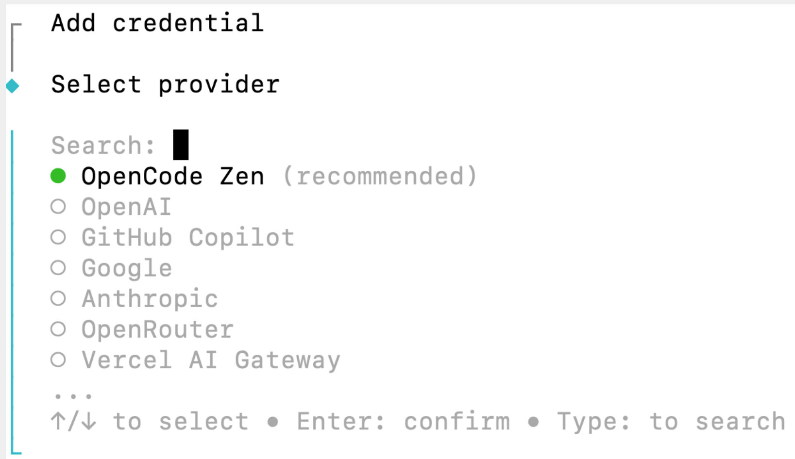
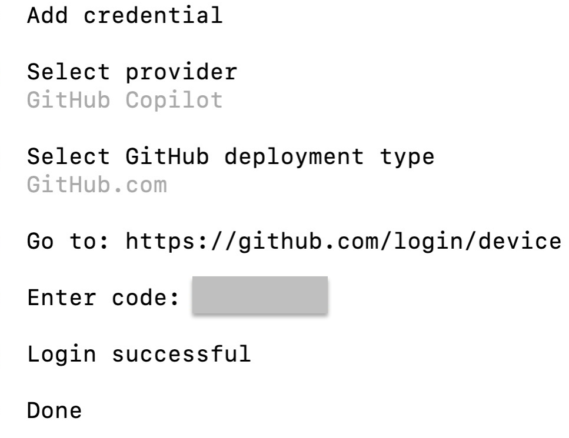
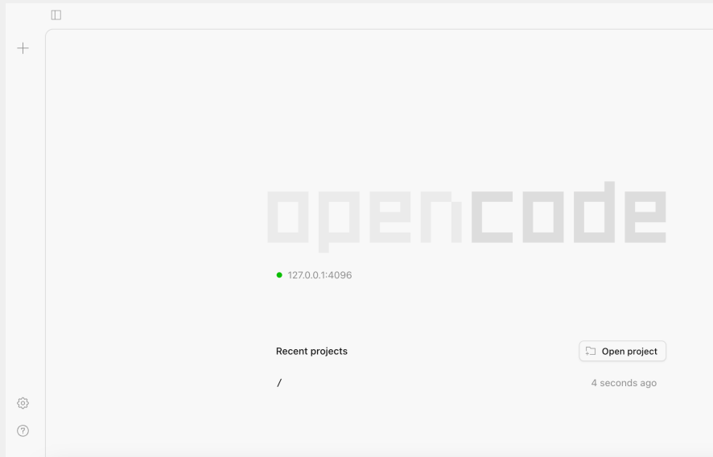
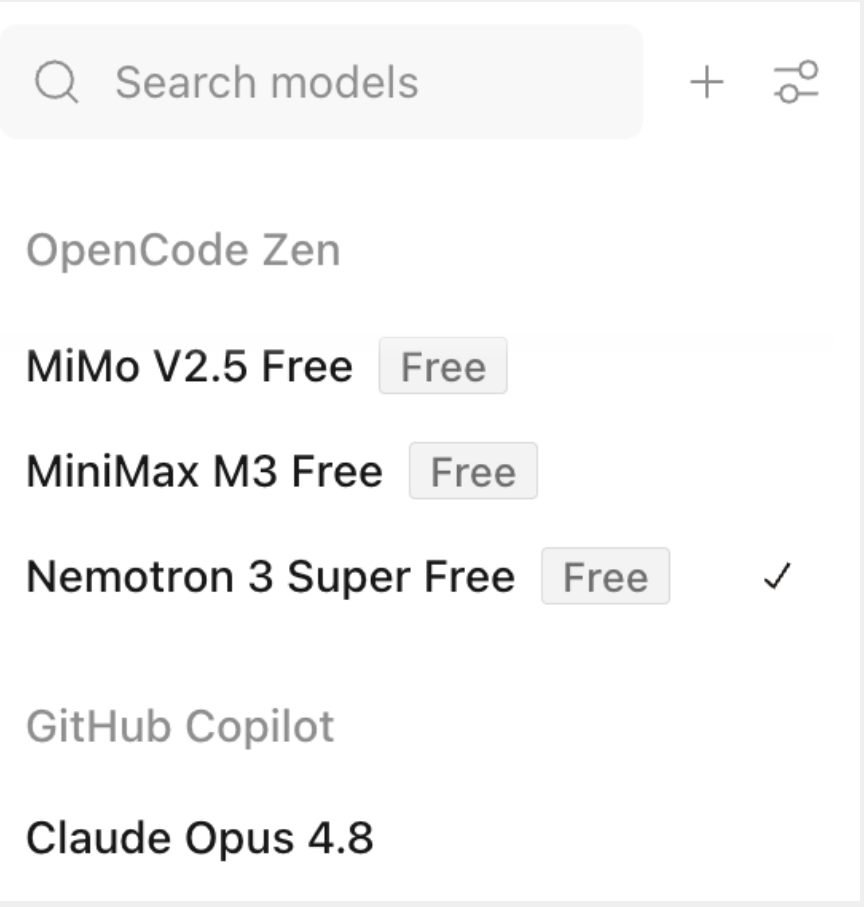
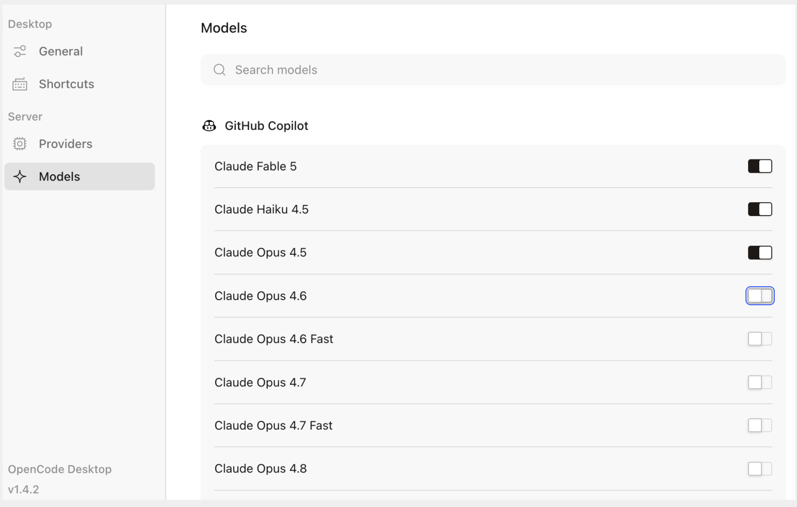
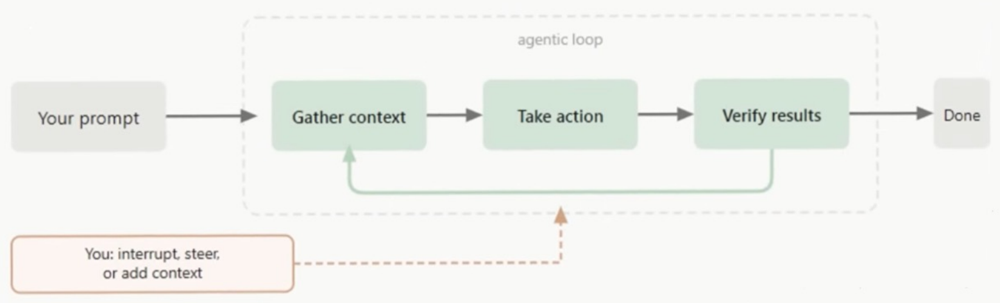
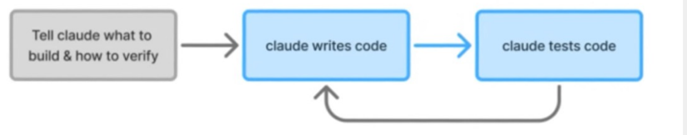

Đại Học Khoa Học Tự Nhiên TPHCM
Khoa Công Nghệ Thông Tin

#  CSC12106

Hướng dẫn đồ án

Lê Thị Nhàn – Itnhan@fit.hcmus.edu.vn


#  Content

· Introduction

• Opencode

● Plan & Skill

· Agent

• Vibecoding


#  1. Introduction

#  Tools

● Claude Code: $20/month, $17*12/year-Anthropic

• OpenCode
– Mã nguồn r

● GitHub Copilot – Microsoft

● Codex (desktop)
- OpenAI


#  Let's start

##  ● Register an account

- GitHub Copilot (edu package, 72-hour validation)

• Cloud & Agent

##  · Install

###  - OpenCode

• https://opencode.ai/

• Sử dụng thông qua CLI, IDE, Desktop


#  OpenCode

● MacOS, Terminal

• Lệnh cài đặt

curl     npm     bun    brew     paru

curl -fsSL https://opencode.ai/install | bash 📑


#  OpenCode

##  • Lệnh login : opencode auth login




#  OpenCode

· Provider : GitHub Copilot

● GitHub deployment type : Github Public

• Go to : https://github.com/login/device

* Device Activation : sử dụng tài khoản đăng ký GitHub Copilot

• Authorize your device : nhập 8 ký tự do OpenCode cung cấp

· OpenCode by Anomaly : nhấn nút xác thực


#  OpenCode


Congratulations, you're all set!

Your device is now connected.




#  OpenCode

• Lệnh mở web : opencode web




Web interface: http://127.0.0.1:4096/

• Lệnh thoát : Control + C


#  2. OpenCode

#  Tạo project

##  • Workspace startup script

– Được chạy mỗi khi workspace được mở

– Mục đích là chuẩn bị môi trường làm việc

– Để trống nếu tạo project trống để thử nghiệm

Workspace startup script

set -e
echo "Workspace ready"

set -e : nếu có lỗi gì đó thì ngưng ngay


#  Chọn model

● Models




#  Chọn model

##  ● Models + GitHub Edu package




#  Hội thoại

• Thử nói chuyện với OpenCode bằng ngôn ngữ tự nhiên

* Prompt : "Bạn có thể giúp gì được cho tôi?"

Xin chào! Tôi là Opencode, một trợ lý AI giúp bạn với các tác vụ liên quan đến phát triển phần mềm. Tôi có thể giúp bạn:

• Viết, sửa, và debug code

- Giải thích và tái cấu trúc code

- Tìm kiếm và hiểu codebase

- Chạy lệnh terminal và scripts

• Tạo và sửa đổi file

- Hỗ trợ các task phức tạp nhiều bước

Bạn có thể cho tôi biết cụ thể bạn cần ayuda gì? (Viết bằng tiếng Việt hoặc tiếng Anh đều được)


#  File Agents.md

##  • File cấu hình cho project

– Đặt tại thư mục gốc của project

– Opencode sẽ đọc file này trước khi đọc prompt đầu tiên nào đó của phiên làm việc

##  - Gồm những quy định của project để OpenCode làm ra những gì chúng ta mong muốn

###  - Tổng quan dự án

• Project này là gì, làm cho ai dùng, mục đích là gì

###  - Tech Stack

● Dùng công nghệ gì (HTML/React/Python)

###  - Quy tắc thiết kế

· Màu sắc chủ đạo, font chữ, style tổng thể

##  - Quy tắc bắt buộc

• Những gì OpenCode không được làm, hoặc là phải làm

##  - Workflow

• Các bước làm việc trong project này


#  File Agents.md

##  • Ví dụ

– Dự án này giới thiệu dịch vụ AI, dùng HTML và CSS thuần, không framework, thiết kế tối giản, màu chủ đạo là màu đen/trắng, font chữ hiện đại, luôn luôn tạo website thân thiện, không dùng màu đỏ, mọi nút bấm đều phải có hover effect, sau mỗi thay đổi lớn thì tự chụp screenshot để so sánh với design gốc...


#  File Agents.md

● Tạo file Agents.md bằng lệnh /init

– File này tự động được thêm vào trong thư mục gốc của project

MyProject/
|
— AGENTS.md
| src/

– Lệnh init sẽ phân tích project và tạo file

• Những gì có sẵn trong thư mục dự án, OpenCode sẽ đọc, rồi lấy thông tin và điền vào file

• Sau đó bổ sung các quy tắc riêng của dự án


#  Global rules

• Nếu muốn mọi projects đều áp dụng quy tắc chung

- Cần đặt file này tại thư mục - ~/.config/opencode/Agents.md

• Ví dụ

Quy tắc chung

- Luôn luôn trả lời bằng tiếng Việt.

- Không bao giờ được tự ý thay đổi phiên bản gói phần mềm mà không hỏi ý kiến trước.


#  3. Plan & Skill

#  Tổ chức thư mục trong project

• Yêu cầu Opencode làm việc theo cách riêng của chúng ta (chứ không chỉ dùng Opencode)

● skills/

– Thực hiện một nhiệm vụ cụ thể

● rules/

– Áp đặt các quy tắc mà AI phải tuân theo

● agents/

– Điều phối các skills thực hiện 1 mục tiêu lớn

● templates/

– Đảm bảo đầu ra có cấu trúc nhất quán


#  Thư mục skills/

● Tạo các thư mục con cho thư mục skills/

- <Myproject>/

• Agents.md

• ...

```
* <skills>/
- <persona>/
  » Plan.md
  » Skill.md
- <value-proposition>/
  » Plan.md
  » Skill.md
- ...
```

● Không nên viết tất cả vào 1 file skill.md vì sẽ khó bảo trì nếu dự án lớn

● Nên chia thành nhiều thư mục giúp quản lý và tái sử dụng dễ hơn


#  File Plan.md

##  • Mô tả

– Skill này dùng khi nào?

– Input là gì?

– Output là gì?

– Workflow gồm những bước nào?

##  • Phục vụ Agent

– Giúp Agent biết khi nào gọi skill này, skill nhận loại dữ liệu gì, trả về loại dữ liệu gì


#  Ví dụ

# Persona Generator

### Purpose

Generate a user persona from user research findings.

## Use this skill when

- The user wants to create a persona.

- The available information includes user goals, tasks, pain points, motivations, or wishes.

- The user has completed the user discovery stage and wants to summarize the findings into a persona.

## Required inputs

One or more of the following:

- Goals

- Tasks

- Pain Points

- Wishes

- Behaviors

- Quotes

- Demographic information

## Output

A completed persona following the selected persona template.

## Workflow

1. Read the available user discovery data.

2. Infer any missing persona attributes when appropriate.

3. Generate a realistic persona.

4. Ensure consistency between goals, tasks, and pain points.

5. Produce the persona in Markdown. # a visual persona as a single-page infographic


#  File Skill.md

##  • Mô tả

– Cách thực hiện công việc (hướng dẫn AI)

– Kiến thức và logic đặc thù của công việc

##  • Phục vụ LLM (để biết phải suy luận như thế nào)

– Làm thế nào để chuyển input thành output một cách đúng đắn và chất lượng?

##  • Skill tốt thường gồm

- Purpose

- Domain knowledge

- Reasoning/Inference strategy

– Validation rules

- Failure handling


#  Ví dụ skill cơ bản

Persona generatorskill

Generate a realistic persona based on user discovery findings.

##  Rules

- Do not invent impossible facts.

- Keep all attributes internally consistent.

- Goals should explain what the user wants to achieve.

- Tasks describe the user's daily activities.

- Pain points explain obstacles.

- Wishes describe improvements desired by the user.

- The representative quote should summarize the user's mindset.


#  Ví dụ skill tốt

##  Knowledge

A persona represents a group of users with similar goals, behaviors, motivations, and pain points.

A good persona should be realistic, internally consistent, and supported by user research.

##  Reasoning

If multiple goals are available, prioritize the primary goal.

If pain points conflict with behaviors, use the observed behaviors.

Infer missing demographic information only when supported by evidence.

Never infer goals from age alone.

Behaviors should support goals.

##  Validation

Check consistency.

Goal vs. Task

Task vs. Pain Point

Pain Point vs. Wish


#  Thứ mục rules/

• Chứa quy tắc dùng chung cho nhiều skills

• Phạm vi

- Domain rule (chuyên ngành)

– Task rule (thực hiện công việc)

– Quality rule (chất lượng)

– Style rule (trình bày)

• Note

- Global rule

– Project rule


#  Thư mục rules/

##  • Ví dụ

```
rules/
```

hci.md
domains/

database.md
hci.md

marketing.md
database.md

machine_learning.md

reasoning.md

quality.md
global/

style.md
quality.md

reasoning.md

style.md
```


#  File hci.md

##  HCI rules

Always use User-Centered Design principles.

Never invent user research findings.

Explain assumptions.

Use HCI terminology consistently.

Prefer ISO 9241 definitions.

Differentiate usability from UX.

Cite Nielsen's heuristics when discussing usability.

Do not confuse persona with user role.

Use examples from interactive systems.


#  File reasoning.md

Task rules

Think step by step.

Explain assumptions.

Do not skip intermediate reasoning.

Always verify mathematical derivations.

Produce Markdown tables.

Explain trade-offs.


#  File quality.md

##  Quality rules

Do not hallucinate.

If uncertain, state uncertainty.

Cite sources when possible.

Never invent references.

Prefer precise terminology.

Never fabricate citations.


#  File style.md

##  Quality rules

Write concise paragraphs.

Avoid emojis.

Respond in Vietnamese.

Always provide English translation.

Use Markdown headings.


#  Cơ chế load rules

##  • (1) opencode.json

```
{ "instructions": [
"rules/hci.md",
"rules/database.md",
"rules/style.md"
] }
```

– OpenCode sẽ đưa các file này vào context cùng với Agents.md

– Nhưng, dễ làm tăng số token


#  Cơ chế load rules

##  • (2) Cho phép trong Agent.md

```
General Rules
      Always answer in Vietnamese.
      Always cite sources when possible.
      Lazy Loading Rules
      If the task is about HCI,
      read @rules/hci.md.
          data.md
          marketing.md
      If the task is about Database,
      read @rules/database.md.
          reasoning.md
  quality.md
      style.md
```

– OpenCode chỉ đọc files cần thiết, không nạp tất cả ngay từ đầu


#  Thư mục templates/

##  • Kết quả được trình bày như thế nào?

– Cấu trúc trình bày

– Định nghĩa layout

##  • Thư mục

- <templates>/

• Persona.md

• ...


#  File Persona.md

```
# Persona Template
## Layout
        A one-page persona with the following sections in order
        1. Header
        2. Profile Summary
        3. Goals
        4. Tasks
        5. Pain Points
        6. Wishes
        7. Behaviors
        8. Representative Quote

## Header
        - Name
        - Occupation
        - Photo (optional)
## Profile Summary
        A brief paragraph (50-100 words) describing the user.
## Goals
        Display as a bullet list.
## Tasks
        Display as a bullet list.
## Pain Points
        Display as a bullet list.
## Behaviors
        Display as a bullet list.
## Wishes
        Display as a bullet list.
## Representative Quote
        Display as a highlighted quotation.
```


#  File Persona.md

Persona Template

Page Size

A4 portrait

Typography

- Name: Heading 1

- Section titles: Heading 2

\# Layout

Two-column layout.

Left column:

- Photo

- Profile Summary

Right column:

- Goals

- Tasks

- Pain Points

- Wishes

- Behaviors

- Quote


#  Renderer

• Khi skill ổn định

– AI tạo ra nội dung cho persona chính xác và nhất quán

● Tự động xuất HTML/Markdown

• Hoặc tích hợp Renderer để xuất ra ảnh

– Tạo ra persona object (JSON), không tạo md

– Cung cấp HTML template (sử dụng placeholder) và CSS

– Dùng HTML Renderer đọc JSON, thay dữ liệu vào template, xuất HTML hoàn chỉnh

– Dùng Playwright/Puppeteer để mở HTML, chụp màn hình, xuất file ảnh PNG


#  File persona.json

```
{ "name": "Dr. Lan Nguyen",
    "age": 42,
    "occupation": "Emergency Physician",
    "photo": "doctor.jpg",
    "background": "Works in a busy emergency department..",
    "goals": [
           "Diagnose patients quickly",
           "Reduce medication errors" ],
    "tasks": [ "Review EHR", "Review lab results",
           "Prescribe medication" ],
    "pain_points": [
           "Information scattered across multiple screens",
           "Frequent interruptions" ],
    "wishes": [ "Unified dashboard", "Automatic allergy alerts" ],
    "quote": "I want to spend more time treating patients than
           searching for information."
}
```


#  File html template

```
{
<!DOCTYPE html>
    <html> <link rel="stylesheet" href="persona.css"> </head>
    <body>
        <div class="card"> <div class="left">
                
                <h1>{{name}}</h1>
                <h3>{{occupation}}</h3>
                <p>{{background}}</p></div>
          <div class="right">
                <h2>Goals</h2><ul>{{goals}}</ul>
                <h2>Tasks</h2><ul>{{tasks}}</ul>
                <h2>Pain Points</h2><ul>{{pain_points}}</ul>
                <h2>Wishes</h2><ul>{{wishes}}></ul>
                <h2>Quote</h2> <blockquote>{{quote}}></blockquote></div>
          </div>
    </body> </html>
}
```


#  File style.css

.card{
            display:flex;
            width:1200px;
            border-radius:20px;
            padding:40px;
            background:white;
}
.left{ width:35%; }
.right{ width:65%; }
```


#  File Persona.md với Placeholder

```
# Persona Template
## Layout
        A one-page persona with the following sections in order:
        1. Header
        2. Profile Summary
        3. Goals
        4. Tasks
        5. Pain Points
        6. Wishes
        7. Behaviors
        8. Representative Quote
## Header
        - {{name}}
        - {{occupation}}
        - {{photo}}
## Profile Summary
        {profile_summary}}
## Goals
        {goals}}
## Tasks
        {tasks}}
## Pain Points
        {pain_points}}
## Behaviors
        {behariours}}
## Wishes
        {wishes}}
## Representative Quote
        {quote}}
```


#  Pipeline tạo persona

• Project hiện tại đơn giản

- Chỉ làm 1 nhiệm vụ : tạo persona

– Không có nhiều bước

• Agents.md làm điều phối là đủ

• Project cần phải điều phối nhiều nhiệm vụ

- Ví dụ : Persona, Scenario, Task Analysis, User Flow, Storyboard, Wireframe

• Nên có thư mục agents/


#  Workflow trong Agents.md

##  • Ví dụ

### Workflow
1. Validate the provided user research information.
2. Invoke the Persona Generator skill.
3. Generate a structured persona object (persona.json).
4. Load the selected HTML/CSS persona template.
5. Populate the template using the generated persona ob
6. Render the completed HTML.
7. Export the rendered page as a PNG image.
8. Return the generated image.
OpenCode khôn

OpenCode không tự động biết cách chuyển HTML thành PNG


#  Workflow trong Agents.md

"Export the rendered page as a PNG image"

• OpenCode chỉ hiểu : cần có 1 bước export

• OpenCode không biết : export bằng cái gì – Chrome?

– Playwright?

– Python?

- ...

· Cần thêm thư mục tools/


#  Tổ chức thư mục (1)

##  • Ví dụ

```javascript
    AGENTS.md
        skills/
        templates/
        tools/
            render_png.py
            render_pdf.py
                render_html.py
OpenCode chỉ việc gọi tool
```


#  Workflow trong Agents.md (1)

##  • Ví dụ

## Workflow

1. Validate inputs.

2. Invoke Persona Generator.

3. Produce persona.json.

4. Load the selected HTML template.

5. Populate the template.

6. Save index.html.

7. Invoke render png.py.

8. Return persona.png.

Agents.md là nơi để mô tả các lệnh thực thi ???


#  Tổ chức thư mục (2)

##  • Với OpenCode CLI, hỗ trợ Custom Tool

```
 project/
|
  | AGENTS.md
  | skills/
  |      persona-generator/
  |     plan.md
  |    skill.md
  |      templates/
  |      persona/
  |      index.html
  |      style.css
  |      .opencode/
                tools/
                render-persona/
                tool.ts
                render.py
```

OpenCode phải có quyền

• gọi 1 tool

• chạy 1 script

.opencode/
tools/
render-persona/
tool.ts
render.js


#  Workflow trong Agents.md (2)

##  • Ví dụ

## Workflow

1. Validate inputs.

2. Invoke Persona Generator.

3. Produce persona.json.

4. Load the selected HTML template.

5. Populate the template.

6. Save index.html.

7. Invoke the render-persona tool

8. Return persona.png.


#  Project persona

• Nên gồm 3 giai đoạn

– Giai đoạn 1: Hoàn thiện persona-generator, index.html và style.css

– Giai đoạn 2: Viết render_png.py (hoặc
render_png.js dùng Playwright)

– Giai đoạn 3: Cập nhật Agents.md để gọi tool render


#  5.Vibecoding

#  Project

##  • Dự án gồm 3 giai đoạn

- 1) Input design template

● Wireframe/Mockup

- 2) Chuẩn bị file .md

– 3) Build và tinh chỉnh


#  Giai đoạn 1

• Chuẩn bị các files ảnh wireframe/mockup

– Dung lượng nên thấp (vài chục KB)

– Resize ảnh nhỏ lại 10% so với ban đầu 100%

– Opencode vẫn hiểu tổng thể layout


#  Giai đoạn 2

● 1) Đưa ảnh wireframe/mockup vào thư mục của project

• 2) Tạo file Agents.md của project

● Prompt

Tôi muốn build một website minh họa thiết kế tương tác. Đây là website có phong cách thiết kế mà tôi muốn <đưa đường dẫn tới file ảnh>. Hãy tạo cho tôi một file Agents.md phù hợp để dùng cho dự án này.


#  Giai đoạn 2

##  • Mở file Agents.md ra xem

– Quy tắc lấy từ ảnh như màu sắc, layout, typography... và những workflow

##  • Thêm vào những quy tắc bắt buộc

Quy tắc bắt buộc

● Sau những thay đổi lớn, chụp screenshot và so sánh với design gốc

● Website phải mobile-friendly

● Mọi section phải có animation khi scroll


#  Giai đoạn 3 - Build

##  ● Prompt

Hãy build một website hoàn chỉnh dựa theo Agents.md và ảnh wireframe này <đường dẫn tới file ảnh>. Bắt đầu với file index.html. Sau khi tạo xong chụp màn hình để so sánh ảnh gốc và tiếp tục tinh chỉnh đến khi design sát với ảnh gốc nhất có thể.


#  Giai đoạn 3

##  • Quan sát

– Opencode sẽ đọc Agents.md trước tiên để hiểu context của dự án

- Tạo file index.html

● Nếu bật thinking ra xem, sẽ thấy kế hoạch chi tiết từng bước như thế nào

##  ● Build xong, prompt

Mở file index.html trong Chrome.

##  • Quan sát tiếp


#  Giai đoạn 3

##  • Tiếp tục hoàn thiện trang web hơn

– Giả sử quan sát trang web thấy vài chỗ font tiếng Việt chưa tốt → yêu cầu AI sửa

##  • Nhưng

– Chúng ta giao task, AI làm, tiếp tục giao task, AI làm tiếp…

– Nếu AI làm sai ngay bước 1, và chúng ta không kiểm tra, thì lỗi chồng lỗi


#  Giai đoạn 3 – Tinh chỉnh

##  • Cách đúng



– Giao task, AI làm, AI tự verify kết quả, tinh chỉnh, rồi verify, rồi lại tiếp tục

• Cơ chế cho AI tự kiểm tra kết quả của chính nó


#  Giai đoạn 3

##  ● Prompt tinh chỉnh

So sánh website hiện tại với ảnh wireframe gốc. Liệt kê tất cả các điểm khác biệt, sau đó tinh chỉnh từng điểm một. Chụp hình screenshot sau mỗi thay đổi để track tiến độ.




Gửi email thắc mắc vào địa chỉ:
- Itnhan@fit.hcmus.edu.vn
