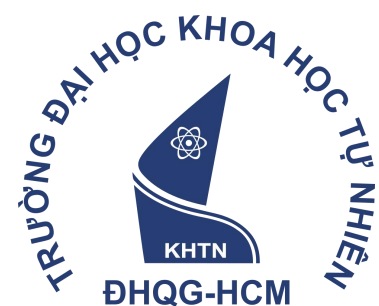

CK

#  BÁO CÁO ĐỒ ÁN CUỐI KỲ

##  Môn: Human Computer Interaction (CSC12106)

TÊN ĐỀ TÀI

##  ỨNG DỤNG HỖ TRỌ lên kế hoạch

Giảng viên hướng dẫn: ThS. Lê Thị Nhàn

Nhóm số: 8

Thành viên: 23127110_VũNgọc Minh Quang

23127385_Lưu Quoc Khánh

23127495_Nguyen Minh Tien

Lóp: 23HTTT01

Ngày nộp: ...

#  Mục lục

1. Giới thiệu $\ldots$

1.1. Bối cảnh và lý do chọn đề tài.

1.2. Mục tiêu của đồ án

1.3. Đối tượng người dùng / người quan tâm.

2. Vấn đề (Problem) — 30%

2.1. Phát biểu vấn đề

2.2. Những khó khăn / bất cập hiện tại.

2.3. Những điểm còn tồn tại, chưa được giải quyết.

3. Các van de liên quân

3.1. Các giải pháp hiện có.

3.2. Điểm khác biệt trong giải pháp của nhóm

4. Ý tưởng

4.1. Mô tả ý tưởng.

4.2. Tính mới và sự thay đổi mang lại cho người dùng....................................................

#  1. Giới thiệu

##  1.1. Bối cảnh và lý do chọn đề tài

Trong môi trường học tập và làm việc hiện nay, làm việc nhóm đã trở thành một hình thức phổ biến và gần như bắt buộc, từ các đồ án môn học, dự án thực tập, cho đến các dự án thực tế tại doanh nghiệp. Tuy nhiên, hiệu quả của làm việc nhóm không chỉ phụ thuộc vào năng lực từng cá nhân mà còn phụ thuộc rất lớn vào cách công việc được phân chia, theo dõi và điều phối giữa các thành viên. Trên thực tế, phần lớn các nhóm hiện nay vẫn đang phân công công việc một cách thủ công thông qua tin nhắn, cuộc gọi nhóm, hoặc bảng tính đơn giản, dẫn đến tình trạng thiếu minh bạch, khó theo dõi tiến độ và dễ xảy ra xung đột về khối lượng công việc.

Nhóm quyết định lựa chọn đề tài xây dựng Hệ thống hỗ trợ phân công và quản lý công việc trong làm việc nhóm vì các lý do sau:

Tính thực tế và khả thi: Việc phân công công việc là một quy trình có thể quan sát, đo lường (qua khối lượng, thời hạn, mức độ hoàn thành) và can thiệp trực tiếp bằng công nghệ, phù hợp với quy mô đồ án môn học.

Khắc phục hạn chế của giải pháp cũ: Các công cụ hiện nay (chat nhóm, bảng tính, ứng dụng quản lý công việc chung) thường không được thiết kế riêng cho đặc thù làm việc nhóm học thuật/dự án nhỏ, thiếu cơ chế hỗ trợ người quản lý ra quyết định phân công dựa trên năng lực và tải công việc thực tế của từng thành viên.

Giá trị thực tiễn cao: Xuất phát từ chính trải nghiệm làm việc nhóm của các thành viên trong lớp, nhóm kỳ vọng sản phẩm không chỉ dừng lại ở mức lý thuyết môn học, mà sẽ trở thành một công cụ hữu ích giúp các nhóm làm việc hiệu quả hơn, giảm xung đột và tăng tính minh bạch trong phân công.

##  1.2. Mục tiêu của đồ án

Nhằm xây dựng một hệ thống thông tin quản lý hỗ trợ tự động ghép nối (mapping) công việc với thành viên phù hợp nhất, dựa trên dữ liệu kỹ năng yêu cầu của công việc và năng lực thực tế của từng thành viên — giúp người quản lý nhóm ra quyết định phân công nhanh chóng, chính xác và minh bạch hơn so với cách làm thủ công. Hệ thống đồng thời hỗ trợ theo dõi tiến độ và thời hạn công việc, giúp các thành viên luôn nắm rõ nhiệm vụ của mình.

##  1.3. Đối tượng người dùng / người quan tâm

● Sinh viên tham gia làm việc nhóm trong các đồ án môn học

Trương nhóm/người điều phối công việc (nhóm trương, quản lý dự án)

● Thành viên nhóm thực hiện công việc được giao

● Giảng viên/người hướng dẫn theo dõi tiến độ nhóm (đối tượng gián tiếp)

Hệ thống cũng có thể được sử dụng cho những nhóm nhỏ

#  2. Vấn đề

##  2.1. Phát biểu vấn đề

Làm việc nhóm về bản chất là một quá trình phân chia và phối hợp công việc giữa nhiều cá nhân để đạt một mục tiêu chung. Vấn đề không nằm ở việc phân công công việc, mà nằm ở việc quá trình phân công và theo dõi công việc hiện nay thiếu công cụ hỗ trợ phù hợp, khiến người quản lý nhóm khó ra quyết định nhanh và chính xác, còn thành viên thì khó nắm bắt đầy đủ thông tin về nhiệm vụ của mình.

Hệ quả đầu tiên và dễ nhận thấy nhất là sự mất cân bằng trong khối lượng công việc giữa các thành viên. Khi việc phân công dựa trên cảm tính hoặc trao đổi miệng, người quản lý khó có cái nhìn tổng thể về việc ai đang làm gì, khối lượng bao nhiêu, còn bao nhiêu thời gian để hoàn thành. Điều này dễ dẫn đến tình trạng một số thành viên bị quá tải trong khi số khác lại thiếu việc, gây mất công bằng và giảm động lực làm việc chung.

Bên cạnh đó là vấn đề thiếu minh bạch về tiến độ. Khi công việc được giao qua tin nhắn rời rạc, không có nơi tập trung để theo dõi trạng thái (chưa bắt đầu, đang làm, đã hoàn thành, trễ hạn), người quản lý thường chỉ phát hiện ra vấn đề khi đã gần đến hạn nộp, không còn đủ thời gian để điều chỉnh hoặc hỗ trợ kịp thời. Với thành viên, việc không có một nguồn thông tin thống nhất về nhiệm vụ, thời hạn và yêu cầu công việc cũng khiến họ dễ hiểu nhầm hoặc bỏ sót nhiệm vụ.

Một khía cạnh khác là thiếu dữ liệu để hỗ trợ ra quyết định. Người quản lý nhóm thường không có cơ sở dữ liệu về năng lực, sở trường hay lịch sử hoàn thành công việc của từng thành viên để đưa ra quyết định phân công hợp lý cho những nhiệm vụ tiếp theo, mà chủ yếu dựa vào trí nhớ hoặc ấn tượng chủ quan.

Cuối cùng, một nghịch lý đáng chú ý là mặc dù làm việc nhóm hướng đến mục tiêu tăng hiệu suất thông qua chia sẻ công việc, việc thiếu công cụ điều phối phù hợp lại có thể làm giảm hiệu suất chung, khi thời gian và công sức bị tiêu tốn vào việc trao đổi, nhắc nhở, và giải quyết mâu thuẫn phát sinh từ phân công không rõ ràng.

Nhìn chung, đây là một vấn đề vừa mang tính cá nhân (mỗi thành viên cần biết rõ nhiệm vụ của mình) vừa mang tính tổ chức (người quản lý cần công cụ điều phối cả nhóm). Điều này đặt ra nhu cầu thực tế về một hệ thống có thể giúp phân công, theo dõi và điều chỉnh công việc nhóm một cách minh bạch và hiệu quả hơn, thay vì dựa vào các phương thức thủ công, rời rạc như hiện nay.

#  2.2. Những khó khăn / bất cập hiện tại

Nếu chỉ nhìn vào hậu quả, người ta dễ nghĩ rằng giải pháp đơn giản là "dùng một ứng dụng quản lý công việc có sẵn". Nhưng trên thực tế, việc áp dụng hiệu quả các công cụ phân công công việc cho làm việc nhóm học thuật/dự án nhỏ khó hơn nhiều so với việc chỉ chọn một phần mềm, bởi nó vấp phải hàng loạt rào cản đến từ cả đặc thù tổ chức nhóm, công nghệ lẫn thói quen của người dùng.

Trước hết, các nhóm làm việc, đặc biệt là nhóm sinh viên, thường có quy mô nhỏ, thời gian tồn tại ngắn (theo học kỳ hoặc theo đồ án) và không có ngân sách hay

quy trình chuẩn hóa như doanh nghiệp. Điều này khiến các nhóm có xu hướng chọn giải pháp "tiện tay" như chat nhóm (Messenger, Zalo) hoặc bảng tính chia sẻ, vốn không được thiết kế chuyên biệt cho việc theo dõi trạng thái và thời hạn công việc.

Bản thân các công cụ quản lý công việc phổ biến hiện nay (như các ứng dụng quản lý dự án thông dụng) thường hướng đến quy trình doanh nghiệp với nhiều tính năng phức tạp, cấu hình rườm rà, đòi hỏi thời gian làm quen. Với một nhóm chỉ có vài thành viên và thời gian làm việc ngắn hạn, việc bỏ thời gian học và duy trì một công cụ phức tạp thường bị xem là không xứng đáng, dẫn đến việc nhóm bỏ ngang sau vài lần sử dụng để quay lại cách làm thủ công.

Theo thời gian, việc trao đổi công việc qua tin nhắn rời rạc trở thành thói quen mặc định của nhiều nhóm, đến mức các thành viên không còn nghĩ đến việc cần một công cụ chuyên biệt để quản lý, dù vẫn thường xuyên gặp phải tình trạng bỏ sót hoặc quên nhiệm vụ.

Một điều cũng cần nhìn nhận thẳng thắn là đằng sau sự thiếu hiệu quả này là chi phí ẩn về thời gian và tâm lý: thời gian dùng để nhắc nhở, xác nhận lại ai làm gì, và những mâu thuẫn phát sinh khi có thành viên cảm thấy mình bị giao việc nhiều hơn người khác một cách không công bằng. Đây chính là những chi phí mà một hệ thống phân công công việc được thiết kế phù hợp có thể giúp giảm thiểu đáng kể.

#  2.3. Những điểm còn tồn tại, chưa được giải quyết

Trước những khó khăn kể trên, không phải là chưa có ai cố gắng giải quyết vấn đề này. Trên thực tế, một số giải pháp đã tồn tại, từ các ứng dụng quản lý công việc dạng bảng Kanban, đến các phần mềm quản lý dự án dành cho doanh nghiệp. Tuy nhiên, khi nhìn kỹ vào cách những giải pháp này vận hành, có thể thấy chúng vẫn còn nhiều khoảng trống chưa thực sự phù hợp với bối cảnh làm việc nhóm quy mô nhỏ.

Điểm dễ nhận thấy nhất là phần lớn các công cụ hiện tại chỉ dừng lại ở việc hiển thị danh sách công việc, chứ chưa thực sự hỗ trợ người quản lý ra quyết định

phân công. Một bảng Kanban cho thấy việc nào đang ở cột nào, nhưng không cho biết ai đang quá tải, ai còn khả năng nhận thêm việc, hay nhiệm vụ nào nên ưu tiên giao cho ai dựa trên năng lực. Nói cách khác, những công cụ này thiếu vắng yếu tố quan trọng nhất: khả năng hỗ trợ ra quyết định phân công đúng người, đúng lúc.

Bên cạnh đó, hầu hết các giải pháp hiện có đều mang tính trung lập một chiều: chỉ là nơi ghi nhận công việc đã được phân công từ trước, mà không quan tâm đến việc phân công đó có hợp lý hay không. Cách tiếp cận này khiến gánh nặng ra quyết định vẫn hoàn toàn nằm ở người quản lý nhóm, công cụ chỉ đóng vai trò lưu trữ thay vì hỗ trợ. Việc thiếu đi cơ chế phản hồi về tải công việc khiến tình trạng mất cân bằng vẫn tiếp diễn dù đã có công cụ.

Cuối cùng, gần như chưa có giải pháp nào được thiết kế riêng cho đặc thù nhóm học thuật/dự án ngắn hạn, nơi thành viên thay đổi theo từng đồ án, thời gian sử dụng ngắn, và không có thời gian để đào tạo cách dùng công cụ. Các công cụ hiện tại thường được xây dựng cho tổ chức lâu dài, chứ không giúp một nhóm mới thành lập có thể bắt đầu phân công công việc hợp lý ngay từ những ngày đầu. Đây chính là khoảng trống lớn nhất mà đề tài này hướng đến giải quyết: không chỉ ghi nhận công việc, mà giúp người quản lý nhóm ra quyết định phân công công bằng, hợp lý, và giúp thành viên luôn nắm rõ nhiệm vụ của mình trong suốt quá trình làm việc nhóm.

#  3. Các giải pháp hiện có

Hiện nay, các công cụ quản lý công việc được chia thành 3 nhóm chính:

Nhóm 1: Quản lý công việc truyền thống (Traditional Task & Project Management)

● Đại diện: Jira, Asana, Monday.com, Trello, ClickUp.

- Cách hoạt động: Cho phép tạo Task, gắn Tag/Label (ví dụ: Design, Frontend, Urgent), gán người phụ trách (Assignee), và cài đặt thời hạn (Due Date) hoặc tạo Gantt Chart.

#  - Điểm hạn chế:

o Thủ công: Người quản lý phải tự tìm người phù hợp để gán việc.

Không đo lường sâu về Kỹ năng: Hệ thống không biết cấp độ thạo công việc (Skill Proficiency) hay khối lượng tải thực tế (Workload capacity) của thành viên tại thời điểm đó để cảnh báo hoặc đề xuất.

#  Nhóm 2: Quản lý nguồn lực nâng cao (Resource Management & Capacity Planning)

● Đại diện: Float, Resource Guru, Runn, Smartsheet.

Cách hoạt động: Tập trung vào việc quản lý Capacity (giờ làm việc/tuần) và Availability (thời gian rảnh) của nhân sự. Một số bên như Float cho phép gắn Tag Kỹ năng cho nhân sự.

● Điểm hạn chế: Chủ yếu giúp PM xem visual trực quan xem ai đang quá tải (Overallocated) hoặc đang rảnh để PM tự kéo-thả sắp xếp, chứ chưa tự động gọi ý/mapping hoàn toàn ra một Timeline tối ưu.

Nhóm 3: Công cụ lập kế hoạch hỗ trợ AI (AI-driven Project & Scheduling Tools)Đại diện: Motion, Reclaim.ai, ClickUp Brain, Wrike (Resource Workflow).

● Cách hoạt động:

o Motion / Reclaim.ai: Tự động xếp lịch công việc vào Calendar cá nhân dựa trên deadline, mức độ ưu tiên và thời gian rảnh.

o AI Assistants (Jira/ClickUp): Tự phân tích mô tả Task để đề xuất tag hoặc phân nhỏ công việc thành sub-task.

● Điểm hạn chế: Tập trung nhiều hơn vào việc tối ưu thời gian cá nhân (Time-blocking) hoặc tự xếp lịch dựa trên thời gian trống, chứ chưa tập trung mạnh vào thuật toán Match Matching giữa Requirement (Kỹ năng + Độ khó) → Resource Capability (Level kỹ năng + Tốc độ làm việc).

#  4. Ý tưởng

##  4.1. Mô tả ý tưởng

Dự án hướng tới xây dựng một nền tảng web quản lý công việc thông minh dựa trên cơ chế tự động ghép nối theo kỹ năng (Skill-based Auto-mapping). Hệ thống hoạt động dựa trên 3 bước chính:

● Nhập liệu hồ sơ năng lực (Skill Profiles): Cho phép ghi nhận danh mục kỹ năng, cấp độ chuyên môn (Junior, Mid, Senior) và khối lượng thời gian khả dụng của từng thành viên.

Nhập liệu yêu cầu đầu việc (Task Requirements): Người quản lý chỉ cần nhập danh sách công việc cùng các yêu cầu về kỹ năng cần thiết, mức độ phức tạp và độ ưu tiên.

Tự động đề xuất kế hoạch (Auto-Generated Timeline): Hệ thống sử dụng thuật toán phân tích để tự động ghép nối công việc với thành viên phù hợp nhất, tính toán thời gian hoàn thành dự kiến dựa trên cấp độ kỹ năng, từ đó dựng nên một bản kế hoạch hoàn chỉnh kèm Timeline/Gantt Chart tối ưu.

##  4.2. Sự khác biệt và tính mới

So với các công cụ hiện có trên thị trường, giải pháp của nhóm mang lại những điểm mới mang tính đột phá:

Chuyển từ "Phân công thủ công" sang "Gợi ý tự động hóa": Thay vì người quản lý phải tự suy nghĩ và gán từng Task, hệ thống chủ động tính toán ra phương án phân bổ nhân sự tối ưu nhất chỉ với một vài thao tác.

Mô hình hóa Kỹ năng & Năng suất: Định lượng hóa mối quan hệ giữa Cấp độ kỹ năng và Thời gian hoàn thành. (Ví dụ: Cùng một Task lập trình, hệ thống hiểu Senior chỉ cần 4 giờ nhưng Junior sẽ cần 8 giờ, từ đó tự động điều chỉnh Gantt Chart chính xác hơn).

Cần bằng tải thông minh: Hệ thống chủ động phát hiện các điểm nghẽn (Bottlenecks) về nhân sự giỏi để đề xuất san chia công việc hoặc cảnh báo rủi ro về tiến độ trước khi dự án bắt đầu.

So sánh giữa 2 quy trình:

● Quy trình cũ:

Nhập task và yêu cầu → Xem xét thành viên → Chia task cho từng người → Vẽ Gantt Chart

● Quy trình mới:

Nhập task và kỹ năng cần thiết → Nhập danh sách thành viên và kỹ năng → Bản kế hoạch tối ưu

#  4.3. Thay đổi và giá trị mang lại cho người dùng

● Đối với Người quản lý (Project Manager / Team Lead):

Tiết kiệm 60-80% thời gian lập kế hoạch và phân công công việc ở giai đoạn đầu dự án.

o Loại bỏ sự thiên vị hoặc đánh giá cảm tính khi giao việc, đảm bảo khối lượng công việc được phân chia công bằng và tối ưu theo đúng năng lực.

● Đối với Thành viên nhóm (Team Members):

o Thực hiện đúng các công việc phù hợp với chuyên môn và cấp độ của bản thân.

o Rõ ràng về Timeline, giảm thiểu tình trạng quá tải (Burnout) do nhận việc vượt quá khả năng hoặc quá thời hạn cho phép.

● Đối với Tổ chức / Dự án:

o Tăng tỷ lệ hoàn thành dự án đúng hạn nhờ bản kế hoạch ban đầu có độ khả thi cao.

o Tận dụng tối đa hiệu suất của nguồn lực hiện có mà không lãng phí thời gian chờ đợi giữa các công việc (Task Dependencies).

Tham khảo

#  I. Giới thiệu

Phát biểu mục tiêu tổng quan của vấn đề

Giới thiệu đề tài đồ án (quy trình nào, đối tượng nào)

● Lý do vấn đề đáng được quan tâm/giải quyết

● Đối tượng sẽ quan tâm đến kết quả đồ án

● Trả lời rõ: làm cái gì / tại sao / mục tiêu / ai dùng / dùng khi nào / ràng buộc / cách dùng kết quả

#  Il. Xem xét tài liệu liên quan (Literature Review / Background)

- Các nghiên cứu/giải pháp đã có liên quan đến vấn đề (state of the art)

Các kỹ thuật cần thành thạo để thực hiện đồ án

Người khác đã giải quyết vấn đề tương tự như thế nào

Cách tiếp cận của nhóm khác gì so với các giải pháp hiện có

#  III. Phương pháp (Methodology/Procedure)

Danh sách nhiệm vụ cụ thể để đạt mục tiêu đồ án

Tài nguyên/công cụ cần thiết (thiết bị, phần mềm, giấy...)

Dữ liệu cần thu thập và cách thu thập (thiết kế khảo sát/phỏng vấn nếu có, đối tượng tham gia — nhớ đủ 5 end-users)

Phương pháp phân tích dữ liệu và áp dụng vào đâu trong đồ án

Lịch trình thực hiện (nên trình bày dạng sơ đồ PERT hoặc Task Chart)

● Phân công nhiệm vụ từng thành viên trong nhóm

#  IV. Kinh phí

Dự trù chi phí (nếu có)

#  V. Thiết kế giải pháp

● Mô tả quy trình cũ (thủ công) vs. quy trình mới (đề xuất)

● Thiết kế giao diện/tương tác (wireframe, mockup — nộp kèm file .pdf riêng)

Giải thích tính sáng tạo trong tương tác

#  VI. Kết quả & Đánh giá

● Prototype hoạt động ra sao (link tới video .mp4 nộp kèm)

Kết quả kiểm thử với người dùng: hành vi người dùng thay đổi thế nào (đây là điểm bắt buộc phải chứng minh)

● Phản hồi từ 5 end-users

#  VII. Kết luận & Hướng phát triển

#  VIII. Tài liệu tham khảo

BÁO CÁO ĐỀ XUẤT ĐỒ ÁN GIỮA KỲ

#  BÁO CÁO ĐỀ XUẤT ĐỒ ÁN GIỮA KỲ

##  Môn: Human Computer Interaction (CSC12106)

##  TÊN ĐỀ TÀI

ng dung ho tr giam thì gian s dung mang xã hội

Giảng viên hướng dẫn: ThS. Lê Thị Nhàn

Nhóm số: 8

Thành viên: 23127110_VũNgọc Minh Quang

23127385_Lưu Quoc Khánh

23127495_Nguyen Minh Tien

Lóp: 23HTTT01

Ngày nộp: 09/07/2026

#  Mục lục

1. Giới thiệu $\ldots$

1.1. Bối cảnh và lý do chọn đề tài.

1.2. Mục tiêu của đồ án

1.3. Đối tượng người dùng / người quan tâm.

2. Vấn đề (Problem) — 30%

2.1. Phát biểu vấn đề

2.2. Những khó khăn / bất cập hiện tại.

2.3. Những điểm còn tồn tại, chưa được giải quyết.

3. Các van de liên quân

3.1. Các giải pháp hiện có.

3.2. Điểm khác biệt trong giải pháp của nhóm

4. Ý tưởng

4.1. Mô tả ý tưởng.

4.2. Tính mới và sự thay đổi mang lại cho người dùng....................................................

#  1. Giới thiệu

##  1.1. Bối cảnh và lý do chọn đề tài

Trong những năm gần đây, mạng xã hội đã trở thành một phần không thể thiếu trong đời sống, đặc biệt là với giới trẻ. Sự phổ biến của smartphone và internet giúp việc tiếp cận thông tin trở nên dễ dàng hơn bao giờ hết. Tuy nhiên, điều này cũng dẫn đến thực trạng nghiện lươt điện thoại một cách vô thức hàng giờ liền, thức khuya xem video, hay mất tập trung khi học tập và làm việc. Đây không còn là câu chuyện cá nhân mà đã trở thành một hiện tượng xã hội phổ biến.

Nhóm quyết định lựa chọn đề tài xây dựng Ứng dụng hỗ trợ hạn chế thời gian sử dụng mạng xã hội vì các lý do sau:

Tính thực tế và khả thi: Khác với các vấn đề vĩ mô, thời gian sử dụng mạng xã hội là yếu tố hoàn toàn có thể quan sát, đo lường và can thiệp trực tiếp bằng công nghệ.

Khắc phục hạn chế của giải pháp cũ: Các ứng dụng hiện nay chủ yếu chỉ dừng lại ở việc nhắc nhở hoặc chặn truy cập một cách cứng nhắc, chưa giải quyết được gốc rễ của hành vi sử dụng theo phản xạ.

Giá trị thực tiễn cao: Xuất phát từ chính trải nghiệm của các thành viên, nhóm kỳ vọng sản phẩm không chỉ dừng lại ở mức lý thuyết môn học, mà sẽ trở thành một công cụ hữu ích giúp người dùng từng bước lấy lại quyền chủ động đối với thời gian và sự tập trung của bản thân.

##  1.2. Mục tiêu của đồ án

Nhằm xây dựng một ứng dụng quản lí thời gian sử dụng mạng xã hội nhằm cải thiện hay giảm thời gian sử dụng chúng một cách hiệu quả

##  1.3. Đối tượng người dùng / người quan tâm

- Học sinh/Sinh viên

- Giới trẻ

- Người sử dụng mạng xã hội nhiều

#  2. Vấn đề

##  2.1. Phát biểu vấn đề

Mạng xã hội từ chỗ là công cụ kết nối đã dần trở thành nơi ngốn phần lớn quỹ thời gian trong ngày của rất nhiều người, đặc biệt là học sinh, sinh viên và người đi làm trẻ. Vấn đề không nằm ở việc sử dụng mạng xã hội mà nằm ở việc thời gian dành cho nó đang vượt quá mức cần thiết.

Hệ quả đầu tiên và dễ nhận thấy nhất là sự sa sút trong hiệu quả học tập và làm việc. Khi một người liên tục bị cuốn vào việc lướt điện thoại, xem video ngắn hay trả lời tin nhắn không quan trọng, mạch tư duy cho công việc chính bị cắt vụn thành từng đoạn nhỏ. Không phải vì họ thiếu năng lực, mà vì sự tập trung bị mạng xã hội lấy mất. Về lâu dài, điều này không chỉ làm giảm năng suất mà còn khiến khả năng tập trung của một người dần yếu đi, kể cả khi không dùng mạng xã hội.

Bên cạnh đó là những ảnh hưởng đến sức khỏe, cả thể chất lẫn tinh thần. Việc ngồi hàng giờ với điện thoại thường đi kèm tư thế xấu, giảm vận động, rối loạn giấc ngủ do sử dụng thiết bị vào ban đêm. Nhưng đáng nói hơn cả là tác động đến sức khỏe tinh thần: việc liên tục tiếp xúc với hình ảnh cuộc sống "hoàn hảo" của người khác dễ khiến người dùng so sánh bản thân một cách vô thức, từ đó hình thành cảm giác tự ti, lo âu, hoặc ngược lại, một sự kỳ vọng thái quá vào bản thân, một dạng ảo tưởng về năng lực hay vị thế xã hội được xây dựng qua lượt thích, lượt theo dõi chứ không phải qua giá trị thực.

Một khía cạnh khác thường bị xem nhẹ là chất lượng thông tin mà người dùng tiếp nhận. Thuật toán của các nền tảng mạng xã hội được thiết kế để giữ chân người dùng càng lâu càng tốt, không phải để đảm bảo tính chính xác của nội dung. Điều này

khiến người dùng dành nhiều thời gian hơn dễ tiếp xúc với thông tin sai lệch, tin giật gân hoặc nội dung mang tính kích động cảm xúc tiêu cực, và theo thời gian, việc này ảnh hưởng đến cách họ nhìn nhận thế giới xung quanh.

Cuối cùng, một nghịch lý đáng chú ý là dù mạng xã hội được tạo ra để kết nối con người, việc sử dụng quá mức lại có xu hướng làm giảm chất lượng tương tác xã hội thật sự. Thời gian dành cho việc trò chuyện trực tiếp, gặp gỡ bạn bè, gia đình bị thu hẹp lại để nhường chỗ cho những tương tác hời hợt qua màn hình. Về lâu dài, điều này có thể dẫn đến sự phụ thuộc: người dùng cảm thấy bất an, khó chịu nếu không thể truy cập mạng xã hội trong một khoảng thời gian.

Nhìn chung, đây là một vấn đề vừa mang tính cá nhân vừa mang tính phổ biến. Điều này đặt ra nhu cầu thực tế về một công cụ có thể giúp người dùng chủ động nhận biết và kiểm soát thời gian sử dụng mạng xã hội của chính mình, thay vì để hành vi sử dụng diễn ra một cách vô thức như hiện nay.

#  2.2. Những khó khăn / bất cập hiện tại

Nếu chỉ nhìn vào hậu quả, người ta dễ nghĩ rằng giải pháp đơn giản là "hãy dùng ít lại". Nhưng trên thực tế, việc giảm thời gian sử dụng mạng xã hội khó hơn nhiều so với một lời khuyên, bởi nó vấp phải hàng loạt rào cản đến từ cả bối cảnh xã hội, công nghệ lẫn chính bản thân người dùng.

Trước hết, chúng ta đang sống trong một thời đại mà thiết bị điện tử gần như là vật bất ly thân. Mạng xã hội luôn nằm trong tầm tay, chỉ cách một cú chạm màn hình, không có khoảng cách vật lý nào để tạo ra một "rào cản tự nhiên" như trước đây. Cùng với đó, độ phổ biến của mạng xã hội đã lan đến mức trở thành một phần của đời sống thường nhật. Ngay cả trẻ em cũng được tiếp xúc với mạng xã hội từ rất sớm khiến thói quen sử dụng thiếu kiểm soát hình thành từ rất sớm và ăn sâu theo thời gian.

Bản thân các nền tảng mạng xã hội cũng không được thiết kế để giúp người dùng dừng lại, ngược lại, chúng được xây dựng để giữ chân người dùng càng lâu

càng tốt. Thuật toán đề xuất nội dung liên tục học hỏi từ hành vi của từng người để đưa ra đúng thứ khiến họ muốn xem tiếp, tạo thành một vòng lặp khó thoát ra. Đặc biệt, khi trí tuệ nhân tạo bắt đầu được ứng dụng để tạo nội dung, tốc độ sản xuất và độ đa dạng của những thứ xuất hiện trên trâng mạng gần như là vô hạn.

Theo thời gian, việc kiểm tra điện thoại không còn là một lựa chọn có ý thức mà trở thành phản xạ, một thói quen ăn sâu đến mức nhiều người bấm mở mạng xã hội mà không thực sự nhớ tại sao mình lại làm vậy. Khi thói quen này đã hình thành ở diện rộng và trở thành xu hướng chung của cả một thế hệ.

Một điều cũng cần nhìn nhận thẳng thắn là đằng sau việc giữ chân người dùng lâu hơn là lợi ích kinh tế rất lớn cho các tập đoàn công nghệ khi mà thời gian người dùng ở lại nền tảng càng nhiều đồng nghĩa với doanh thu quảng cáo càng cao. Điều này lý giải vì sao gần như không có động lực nào từ phía nhà phát triển nền tảng để giúp người dùng giảm thời gian sử dụng; mọi thiết kế, từ giao diện cuộn vô hạn đến hệ thống thông báo, đều đang đi theo chiều hướng ngược lại với mục tiêu mà người dùng thực sự mong muốn cho bản thân mình.

#  2.3. Những điểm còn tồn tại, chưa được giải quyết

Trước những khó khăn kể trên, không phải là chưa có ai cố gắng giải quyết vấn đề này. Trên thực tế, một số giải pháp đã tồn tại, từ tính năng nhắc nhở thời gian sử dụng có sẵn trên điện thoại, đến các ứng dụng chặn truy cập của bên thứ ba. Tuy nhiên, khi nhìn kỹ vào cách những giải pháp này vận hành, có thể thấy chúng vẫn còn nhiều khoảng trống chưa thực sự chạm đến gốc rễ của vấn đề.

Điểm dễ nhận thấy nhất là phần lớn các công cụ hiện tại chỉ dừng lại ở việc thông báo, chứ chưa thực sự can thiệp vào hành vi. Một dòng chữ nhắc "bạn đã dùng 3 giờ hôm nay" xuất hiện trên màn hình thường chỉ được đọc lướt qua rồi bị bỏ qua, bởi vào đúng thời điểm đó người dùng đang bị cuốn vào nội dung và không có đủ động lực để dừng lại. Nói cách khác, những nhắc nhở này thiếu vắng yếu tố quan

trọng nhất: khả năng tác động đúng lúc, đúng cách để thực sự thay đổi hành vi ngay tại thời điểm cám dỗ lớn nhất.

Bên cạnh đó, hầu hết các giải pháp hiện có đều mang tính áp đặt một chiều: đặt ra một giới hạn cứng nhắc rồi chặn truy cập khi hết giờ, mà không quan tâm đến lý do tại sao người dùng lại sử dụng nhiều đến vậy. Cách tiếp cận này thường khiến người dùng cảm thấy bị kiểm soát từ bên ngoài hơn là được hỗ trợ, dẫn đến tâm lý phản kháng, tìm cách lách luật, hoặc đơn giản là gỡ bỏ ứng dụng sau vài ngày sử dụng. Việc thiếu đi sự cá nhân hóa khiến các giải pháp này khó duy trì hiệu quả lâu dài.

Cuối cùng, gần như chưa có giải pháp nào giúp người dùng xây dựng lại nhận thức và thói quen một cách bền vững sau khi ứng dụng bị gỡ bỏ. Các công cụ hiện tại thường đóng vai trò như một hàng rào tạm thời trong lúc được cài đặt, chứ không giúp người dùng dần hình thành khả năng tự kiểm soát để khi không còn công cụ đó nữa, họ vẫn có thể duy trì thói quen sử dụng lành mạnh. Đây chính là khoảng trống lớn nhất mà đề tài này hướng đến giải quyết: không chỉ chặn hay nhắc nhở, mà giúp người dùng thực sự hiểu và làm chủ hành vi sử dụng mạng xã hội của chính mình.

#  3. Các van de liên quân

##  3.1. Các giai pháp hiện có

Trên thị trường hiện nay đã có khá nhiều ứng dụng ra đời với mục tiêu giúp người dùng kiểm soát thời gian sử dụng điện thoại và mạng xã hội, mỗi ứng dụng chọn một hướng tiếp cận khác nhau để giải quyết vấn đề này.

Nhóm ứng dụng phổ biến nhất đi theo hướng "chặn cứng". Giúp đặt lịch hoặc đặt ngưỡng thời gian rồi khóa hoàn toàn quyền truy cập khi vượt quá giới hạn. Apple Screen time là một ví dụ điển hình: ứng dụng này khóa các ứng dụng khác trên điện thoại sau khi được sử dụng trong một khoảng thời gian chỉ đinh. Offtime cũng vận hành theo logic tương tự khi chặn các hoạt động liên quan đến mạng xã hội, tin

nhắn, liên lạc từ danh bạ và cho phép người dùng thiết lập chế độ riêng cho từng bối cảnh như giờ làm việc hay thời gian dành cho gia đình. Trên máy tính, StayFocusd đi theo hướng chặn truy cập các trang mạng xã hội gây mất tập trung trong những khung giờ do người dùng tự đặt ra.

Một hướng tiếp cận khác nhẹ nhàng hơn là dùng động lực tích cực thay vì cấm đoán trực tiếp. Forest là cái tên tiêu biểu nhất cho hướng này: mỗi khi cần tập trung, người dùng "trồng" một hạt giống ảo, cây sẽ lớn dần nếu họ không chạm vào điện thoại, và sẽ héo nếu họ thoát ra dùng ứng dụng khác. Về mặt kỹ thuật, các phiên bản mới của Forest trên Android còn sử dụng API hỗ trợ tiếp cận để quản lý các ứng dụng gây gián đoạn đã được người dùng thêm vào danh sách chặn, cho thấy xu hướng các app hiện nay bắt đầu khai thác sâu hơn vào hệ thống thay vì chỉ hiển thị thông báo đơn thuần.

Nhóm thứ ba tập trung vào việc theo dõi và cảnh báo dựa trên số liệu sử dụng thực tế, gần với cách tiếp cận "dashboard" hơn là can thiệp trực tiếp. Moment là ví dụ cho nhóm này khi ghi nhận thời gian sử dụng cũng như số lần mở khóa điện thoại và gửi cảnh báo khi người dùng chạm ngưỡng đáng lo ngại, đồng thời cho phép người dùng đặt giới hạn cho từng ứng dụng riêng lẻ.

Đáng chú ý nhất trong số các giải pháp hiện có, và cũng gần với hướng đi mà nhóm đang theo đuổi, là One Sec, ứng dụng khai thác ý tưởng chèn một khoảng nhiệm vụ nhỏ ngay tại thời điểm người dùng mở ứng dụng mạng xã hội. Theo mô tả của ứng dụng, mỗi khi người dùng mở một ứng dụng đã được chỉ định, họ sẽ phải trải qua một nhiệm vụ ngắn như bài tập hít thở, nhằm tạo ra khoảng dừng để suy nghĩ trước khi tiếp tục. Ứng dụng còn có một tính năng khá thú vị là Good Morning Countdown giúp ngăn việc mở các ứng dụng đã chọn cho đến khi hệ thống xác nhận người dùng đã thức dậy được ít nhất một giờ, dựa trên dữ liệu từ ứng dụng sức khỏe trên thiết bị

#  3.2. Điem khác biệt trong giai pháp cua nhóm

Nhìn vào bức tranh chung ở trên, có thể thấy các giải pháp hiện có, dù đã đi theo nhiều hướng khác nhau, vẫn thường chỉ mạnh ở một khía cạnh mà thiếu đi sự kết hợp toàn diện. Các ứng dụng chặn cứng như Offtime hiệu quả trong việc ngăn chặn tức thời nhưng mang tính áp đặt một chiều, không quan tâm đến lý do hay thời điểm cụ thể khiến người dùng dễ mất kiểm soát nhất. Forest tạo động lực tích cực rất tốt nhưng lại phù hợp hơn với các phiên tập trung ngắn có chủ đích hơn là việc điều chỉnh thói quen sử dụng mạng xã hội rải rác suốt cả ngày. Moment mạnh về việc thu thập số liệu nhưng phần cảnh báo vẫn khá chung chung, chưa thực sự cá nhân hóa theo từng kiểu hành vi. Còn One Sec, dù đã tiệm cận khá gần với ý tưởng "can thiệp tại thời điểm mở app" mà nhóm hướng tới, thì phần can thiệp vẫn mang tính cố định và áp dụng đồng loạt cho mọi khung giờ đã cài đặt, chứ chưa thực sự dựa trên việc phân tích sâu thói quen riêng của từng người để xác định đâu là thời điểm "điểm nóng" cần can thiệp mạnh hơn.

Điểm khác biệt cốt lõi trong giải pháp của nhóm nằm ở việc kết hợp cả ba yếu tố mà từng ứng dụng hiện có mới chỉ làm tốt một phần: phân tích hành vi cá nhân hóa để tìm ra insight riêng cho từng người, can thiệp linh hoạt ngay tại thời điểm sử dụng với nhiều dạng nhiệm vụ khác nhau tùy theo mức độ sử dụng thường thấy của khung giờ đó và một vòng lặp phản hồi liên tục giúp giới hạn thời gian cũng như hình thức can thiệp được điều chỉnh dần theo tiến bộ thực tế của người dùng, thay vì giữ nguyên một cấu hình tĩnh từ đầu đến cuối.

#  4. Ý tưởng

##  4.1. Mô tả ý tưởng

Thay vì đi theo hướng "cấm đoán" như phần lớn ứng dụng kiểm soát thời gian hiện nay, nhóm hướng đến một cách tiếp cận mềm hơn nhưng tác động đúng vào thời điểm quan trọng nhất: ngay khoảnh khắc người dùng chuẩn bị mở mạng xã hội.

Ý tưởng cốt lõi xoay quanh ba lớp hoạt động gắn kết với nhau. Đầu tiên, ứng dụng sẽ âm thầm quan sát và ghi nhận thói quen sử dụng thực tế của từng người, không chỉ là tổng thời gian sử dụng trong ngày, mà là những chi tiết cụ thể hơn: khung giờ nào người dùng có xu hướng mở mạng xã hội nhiều nhất, phiên sử dụng nào kéo dài bất thường, việc sử dụng có xu hướng dồn vào lúc nào trong ngày. Từ những dữ liệu tưởng chừng nhỏ nhặt này, ứng dụng có thể chỉ ra được những insight rất riêng cho từng người.

Lớp thứ hai là phần can thiệp trực tiếp vào hành vi, lấy cảm hứng từ cách các ứng dụng báo thức hiện nay buộc người dùng phải giải một bài toán nhỏ, quét mã QR, hoặc lắc điện thoại mới có thể tắt được chuông. Áp dụng logic tương tự, khi người dùng chạm vào biểu tượng mạng xã hội, đặc biệt là trong những khung giờ đã được xác định là "điểm nóng" dựa trên insight ở trên, ứng dụng sẽ chèn vào một nhiệm vụ nhỏ trước khi cho phép mở ứng dụng: có thể là vài giây hít thở có hướng dẫn, một câu hỏi ngắn để người dùng tự hỏi lại "mình mở app này để làm gì", một bài tập trí nhớ đơn giản, hoặc gõ lại một câu nhắc nhở mục tiêu mà chính người dùng đã đặt ra trước đó. Khoảng dừng nhỏ này tạo ra một khoảng trống đủ để phần lý trí kịp lên tiếng trước khi thói quen theo phản xạ tiếp quản, biến việc mở mạng xã hội từ một hành động vô thức thành một lựa chọn có ý thức.

Lớp thứ ba là việc thiết lập giới hạn thời gian sử dụng, nhưng giới hạn này không cố định một cách máy móc mà được đề xuất dựa trên chính dữ liệu hành vi của người dùng, có thể điều chỉnh dần theo từng tuần. Song song đó, ứng dụng liên tục theo dõi thời gian sử dụng thực tế và đưa ra những gợi ý điều chỉnh phù hợp với nhịp sống của từng người. Hệ thống gợi ý dựa trên xu hướng riêng, ví dụ đề xuất rút ngắn dần thời gian sử dụng buổi tối nếu phát hiện đây là khung giờ gây ảnh hưởng đến giấc ngủ, hoặc khen ngợi và củng cố khi người dùng duy trì được một ngày sử dụng đúng như mục tiêu đã đặt ra.

#  4.2. Tính mới và sự thay đổi mang lại cho người dùng

Điểm khác biệt lớn nhất của ý tưởng này so với các giải pháp hiện có nằm ở việc nó không cố ngăn chặn người dùng cứng hay ra lệnh, mà chọn cách chen vào đúng khoảnh khắc quyết định để mở ra một khoảng dừng cho lý trí, nghỉ ngơi. Việc yêu cầu hoàn thành một nhiệm vụ nhỏ trước khi mở ứng dụng không nhằm mục đích gây khó chịu hay trừng phạt, mà đóng vai trò cắt đứt thói quen bấm mở ứng dụng theo phản xạ, để người dùng có một nhịp ngắn ngủi tự hỏi lại liệu mình có thực sự cần mở lúc này hay không. Đây là sự khác biệt căn bản so với các ứng dụng khóa app truyền thống, vốn chỉ đơn thuần chặn hoặc không chặn mà không tạo ra bất kỳ tương tác nào ở giữa.

Cái mới thứ hai là việc cá nhân hóa dựa trên insight hành vi thay vì áp dụng một khuôn mẫu chung. Những gợi ý và can thiệp mà ứng dụng đưa ra sẽ khác nhau theo từng người, khiến giải pháp trở nên sát với thực tế sử dụng hơn là một quy tắc cứng áp đặt từ trên xuống.

Về sự thay đổi hành vi mà ý tưởng này hướng đến, mục tiêu không dừng lại ở việc giảm số giờ sử dụng trong ngắn hạn, mà là giúp người dùng dần lấy lại thói quen tự nhận thức mỗi khi có ý định mở mạng xã hội. Khi việc dừng lại một nhịp trước khi mở app được lặp đi lặp lại đủ nhiều, nó có thể dần trở thành một phản xạ mới, giúp người dùng ngày càng chủ động hơn trong việc quyết định khi nào nên và không nên sử dụng, thay vì để thuật toán và thói quen cũ dẫn dắt. Về lâu dài, đây chính là sự khác biệt giữa một công cụ chỉ "giúp cai" trong thời gian ngắn với một công cụ thực sự giúp người dùng xây dựng lại năng lực tự kiểm soát của chính mình.

