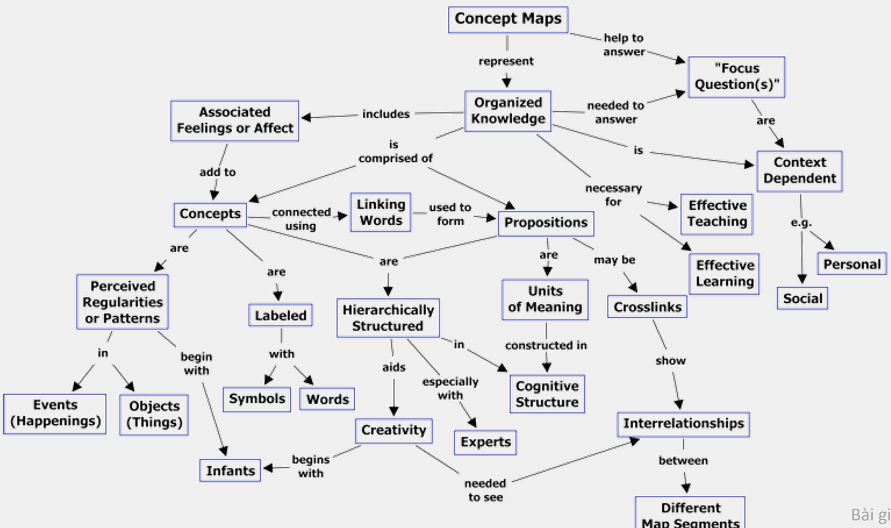
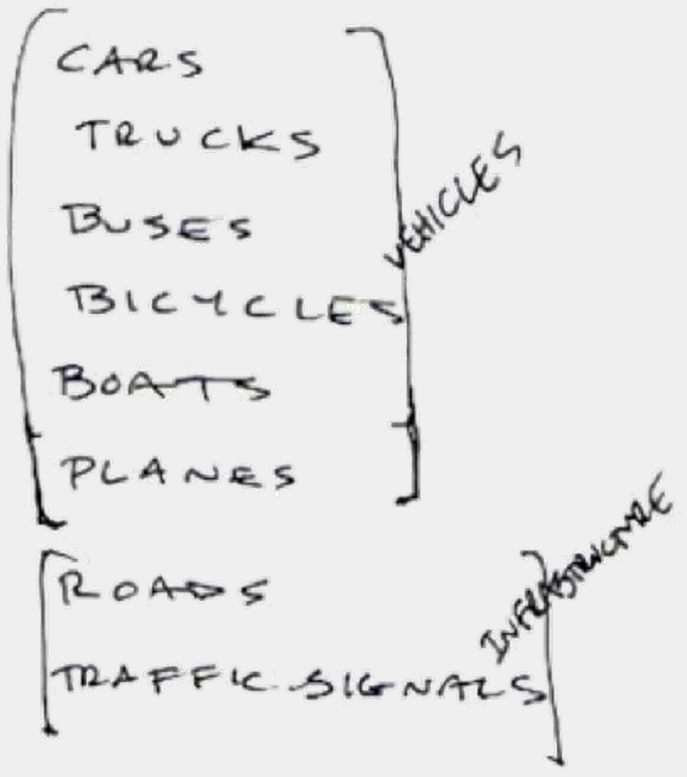
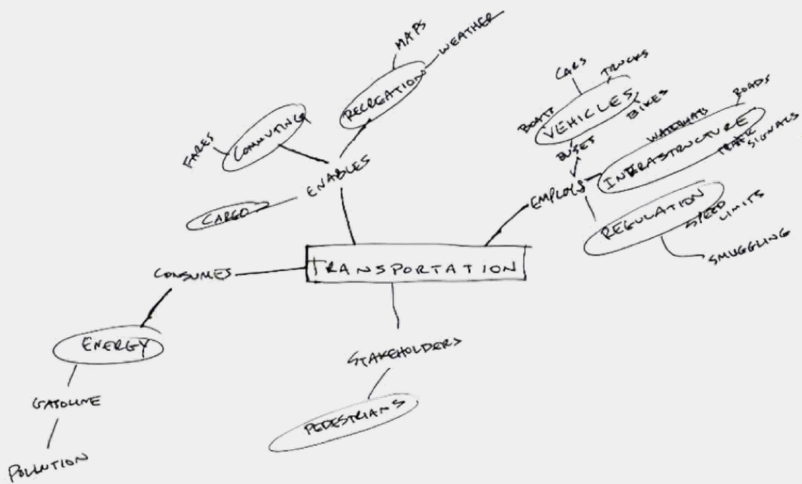
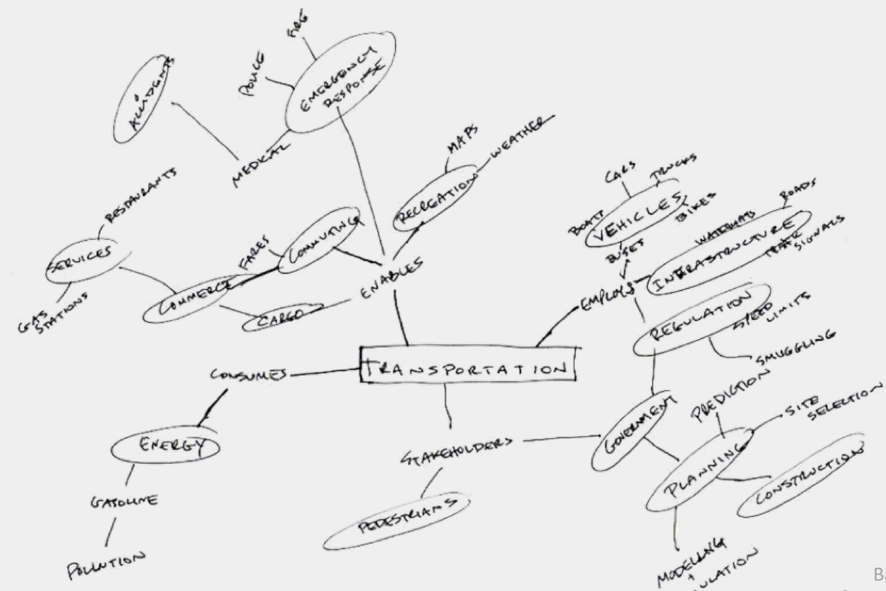
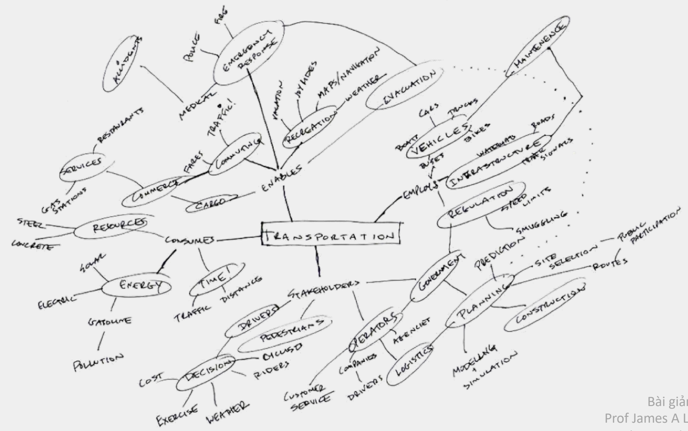
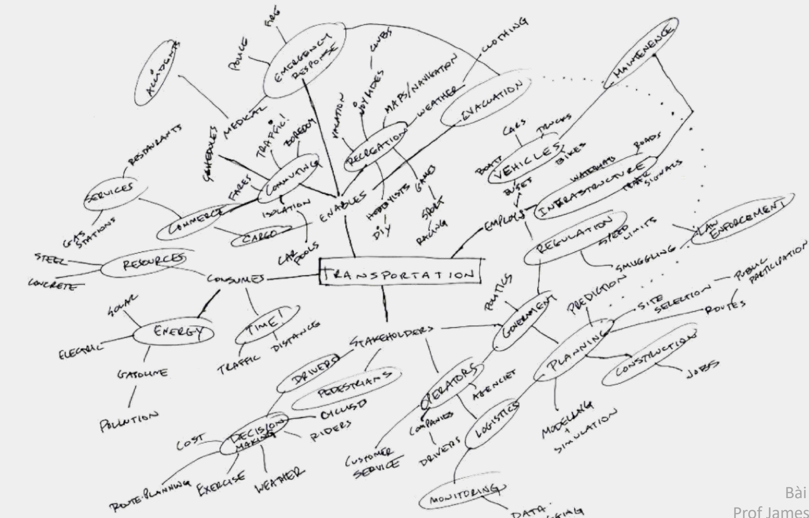
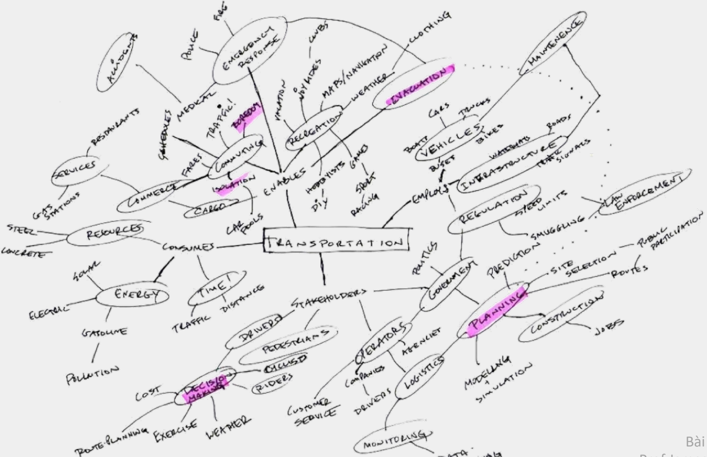
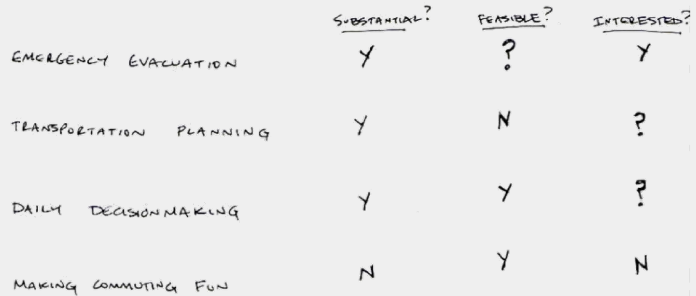

Đại Học Khoa Học Tự Nhiên TPHCM
Khoa Công Nghệ Thông Tin

#  CSC12106

Hướng dẫn đồ án

Lê Thị Nhàn – Itnhan@fit.hcmus.edu.vn

#  Nội dung

• Lập nhóm

• Tìm đề tài

• Cột mốc

• Chủ đề

• Đề xuất (mid-term)

• Cuối kỳ (final)

#  1. Lập nhóm

#  Danh sách nhóm

##  ● Group of 3

– Nhóm 1

– Nhóm 2

– Nhóm 3

– Nhóm 4

– Nhóm 5

– Nhóm 6

– Nhóm 7

– Nhóm 8

– Nhóm 9

#  Chìa khóa để nhóm thành công

##  • Cam kết chung

– Đòi hỏi phải có 1 mục đích mà thành viên trong nhóm đều tin tưởng

– Ví dụ

• Chứng minh tất cả trẻ em đều có thể học

• Cách mạng hóa làm thế nào để sử dụng năng lượng tại nhà

##  • Tiêu chí hoạt động phải cụ thể

– Đến trực tiếp từ mục đích chung

– Duy trì được mục tiêu đặt ra

#  Chìa khóa để nhóm thành công

• Kết hợp đúng đắn các kỷ năng

– Lập trình, thiết kế, viết báo cáo

– Giải quyết vấn đề và ra quyết định

– Giao tiếp

• Sự tán thành

– Ai làm nhiệm vụ gì

– Khi nào gặp nhau và thực hiện công việc

– Lịch làm việc

#  Hoạt động của nhóm

• Làm quen với nhau & thường xuyên gặp gỡ

● Tìm ra điểm mạnh của từng thành viên trong nhóm

• Phân công cho từng thành viên một vai trò

– Người quản lý nhóm

- Thiết kế

– Kiểm định/kiểm thử

– Soạn tài liệu

– Phát triển và cài đặt

#  2.
Tìm đề tài

#  Gợi ý cho tìm vấn đề

● Tránh những vấn đề khó và không thể giải quyết

– Không được định nghĩa rõ ràng

– Phức tạp và dính líu với nhau

– Có nhiều bên liên quan, quan điểm khác nhau

- VD:

• Ô nhiễm không khí

– Không có quy luật dừng

– Các vấn đề không được chế ngự, không được giải quyết

- VD:

• Lão hóa

#  Gợi ý cho thiết kế

- Các giải pháp phụ thuộc vào cách thức vấn đề được dựng lên... và ngược lại

• Các giải pháp không tối ưu

– Không có đúng hay sai, nhưng mà có tốt hơn và tệ hơn

• Mỗi vấn đề là duy nhất

– Cần phải có những phương pháp tiếp cận sáng tạo

#  Cách tiếp cận

• 1) Khảo sát, thăm dò vấn đề

● 2) Tìm một điểm mấu chốt – Điểm này là đòn bẩy để ta đi tới giải pháp

• 3) Thiết kế ra việc can thiệp

• 4) Quan sát coi điều gì xãy ra

• 5) Lặp lại 1

#  Phương pháp

• Ánh xạ khái niệm (concept mapping)

– Tạo ra một mô hình

– Tìm ra những gì mình đã biết

• Tạo ra ý tưởng

– Khảo sát không gian giải pháp

#  Ánh xạ khái niệm

• Là một kỹ thuật để hình dung các mối quan hệ giữa những ý tưởng

• Bản đồ khái niệm (concept map)

– Sơ đồ biểu diễn các mối quan hệ giữa những khái niệm

– Là một công cụ đồ họa để trình bày tri thức

#  Ánh xạ khái niệm

Bài giảng của
Prof James A Landay
Đại học Washington

#  Ánh xạ khái niệm

##  • Quy trình

– Liệt kê 10-20 từ liên quan tới chủ đề

– Gom chúng vào các thể loại (categories)

– Bắt đầu về sơ đồ

– Thêm thể loại và ví dụ

– Gán nhãn cho các mối quan hệ

– Tiếp tục cho đến khi không thể thêm nữa hoặc hết thời gian

– Làm nổi bật những vùng để khảo sát thêm nữa

#  Ánh xạ khái niệm

##  • Kết quả

– Một mô hình (không phải mô hình sau cùng)

– Một vài hướng để thiết kế

#  Bước 1: Liệt kê các từ có liên quan

##  TRANSPORTATION

| CARS | PEDESTIANS | SMJGGLINGT |
| --- | --- | --- |
| TRUCKS | CARGO | MAPS |
| BUSES |  |  |
| BICCHLES | SPEED LIMITS | FARES |
| BOATS | POLLUTION | RAIN |
| PLANES | GASOLING |  |
| ROADS | COMMUTING |  |
| TRAFFIC SIGNALS | RECREATION |  |

Bài giảng của
Prof James A Landay
Đại học Washington

#  Bước 2: Nhóm vào các thể loại

##  TRANSPORTATION

Pedestrians

CAQ G O

SPEED LIMITS - REGULATION

POLLUT 10-1

Garso line → ENERGY

$$ \int (com \nu \tau \sim G) $$

RECREATION

SM 2 G G L 12 G T

MAPS - NAVIGATION

FARES- TRANSACTION

$$R\text{A}\text{N} - W\text{E}\text{A}\text{R}$$

Bài giảng của
Prof James A Landay
Đại học Washington

#  Bước 3: Bắt đầu về sơ đồ

Bài giảng của
Prof James A Landay
Đại học Washington

#  Bước 4: Thêm thể loại + ví dụ

Bài giảng của
Prof James A Landay
Đại học Washington

#  Bước 5: Tiếp tục

Bài giảng của Prof James A Landay Đại học Washington

#  Bước 6: Và tiếp tục

Bài giảng của Prof James A Landay Đại học Washington

#  Bước 7: Làm nổi bật

Bài giảng của
Prof James A Landay
Đại học Washington

#  Bước 8: Chính sửa và ưu tiên

Bài giảng của
Prof James A Landay
Đại học Washington

#  Bước kế: Nghiên cứu & phân tích

• Vấn đề lớn như thế nào?

• Vấn đề của ai?

• Đã có những gì tồn tại rồi?

• Những gì hiện tại đã được thực hiện ra sao?

• Làm sao có thể cải tiến được những thứ đó?

Bài giảng của
Prof James A Landay
Đại học Washington

#  3. Cột mốc

#  Giữa kỳ

• Tuần thứ 5

• Phải nộp

– Báo cáo đề xuất (.pdf & .md)

• File cấu hình project tổng thể (Opencode.md)

● Plan.md & skill.md

- Slide trình bày (.pdf)

- Zip files, <group-STT>.zip

→ Nộp files lên Moodle hoặc Google Drive

→ Nộp giấy trực tiếp

#  Cuối kỳ

• Tuần thứ 13

• Phải nộp

##  – Tập tin

• Báo cáo đồ án (.pdf & .md)

• Slide trình bày (.pdf)

• Các thiết kế giao diện bằng công cụ (.pdf)

• Video prototype (.mp4)

• VibeCode (.zip)

→ Nộp lên Moodle hoặc Google Drive

— Giấy

● Poster, prototype

• Báo cáo đồ án

→Nộp trực tiếp

#  4. Chủ đề của đô án

#  Gợi ý chủ đề

● Trong hệ thống thông tin quản lý, thiết kế giao diện/tương tác mới cho

– Việc mua/bán hàng trên mạng

– Nhân viên tại các kho hàng hóa

– Người quản lý ra quyết định nhanh chóng

– Nhân viên họp hành, trao đổi trực tuyến

– Khách hàng cung cấp/truy xuất thông tin

– Người thủ thư, người đọc trong thư viện

– Đăng ký học phần cho sinh viên/giáo viên

- ...

• Cần tiếp cận được với 5 end-users

#  Chủ đề

• Chọn 1 quy trình muốn làm – Cải tiến quy trình dễ dàng

• Không giới hạn thiết bị giao tiếp, tương tác

• Đồ án phải chỉ ra được – Sự thay đổi

• Thay đổi được hành vi người dùng (theo chiều hướng có lợi hơn cho họ trong công việc)

– Tính sáng tạo

• Giúp người sử dụng linh hoạt giải quyết công việc hiệu quả

#  5.Đề xuất

#  Nội dung

• Giới thiệu

• Xem xét lại những gì mà người ta đã làm được trước đó

- Literature review

- Background

• Phương pháp

- Procedure

- Methodology

● Kinh phí

#  Giới thiệu

• Phát biểu những mục tiêu tổng quan của vấn đề

• Giới thiệu đề tài của đồ án

• Giải thích tại sao vẫn đề xứng đáng được quan tâm và giải quyết

• Ai sẽ là người quan tâm tới kết quả của đồ án

#  Giới thiệu

• Đồ án làm về cái gì?

• Tại sao phải thực hiện đồ án này?

• Các mục tiêu của đồ án?

• Ai là người sử dụng kết quả của đồ án?

• Khi nào thì kết quả của đồ án được sử dụng?

• Ràng buộc nguyên liệu, mục đích của đồ án ?

● Kết quả của đồ án sẽ được sử dụng như thế nào?

● Các phương pháp/quy trình thực hiện đồ án là gì?

#  Xem xét tài liệu liên quan

• Chứng tỏ cho giáo viên mình biết những gì mình đang nói (liên quan tới đồ án)

• Cần minh họa mình biết mọi nền tảng và ngữ cảnh của đồ án

#  Xem xét tài liệu liên quan

• Các loại nghiên cứu đã được thực hiện trước đó là gì?

• Các kỹ thuật nào cần phải được sử dụng thành thạo trong đồ án?

• Bức tranh về những gì đang có của đồ án?

– State of the art

• Những người khác đã cố gắng giải quyết vấn đề mà bạn đang muốn làm như thế nào?

• Cách tiếp cận mà bạn sẽ xây dựng là gì? Nó khác gì so với những cái đã có?

#  Phương pháp

• Cho giáo viên thấy được bạn đề xuất thực hiện đồ án như thế nào

• Thuyết phục giáo viên mình

– Hiểu rõ nhiệm vụ

– Có kế hoạch về thời gian thực hiện đồ án hợp lý để giải quyết vấn đề trong đồ án

– Nhận diện được tất cả tài nguyên mà mình cần

#  Phương pháp

• Những nhiệm vụ đã được xác định nhằm đạt được mục tiêu của đồ án là gì?

• Những tài liệu, đồ dùng cần cho việc thực hiện đồ án là gì?

– Thiết bị, máy tính, đồ họa, giấy...

• Những dữ liệu nào cần cho đồ án? Thu thập dữ liệu bằng cách nào?

– Nếu yêu cầu làm khảo sát, phỏng vấn thì phải thiết kế khảo sát, cho biết ai tham gia phỏng vấn

• Phương pháp sẽ sử dụng để phân tích dữ liệu? Áp dụng vào chỗ nào của đồ án?

#  Phương pháp

• Thời gian dự kiến sẽ hoàn thành đồ án?

– Lịch thực hiện nên trình bày theo sơ đồ PERT hoặc Task Charts

• Thành viên nào trong nhóm sẽ đảm nhiệm thực hiện nhiệm vụ nào, công việc nào của đồ án?

• Chi phí cho đồ án là bao nhiêu?

#  5. Cuối kỳ

#  Báo cáo

• 1.Giới thiệu

· 2.Nghiên cứu người dùng

• 3.Yêu cầu và mục tiêu thiết kế

• 4.Phân tích hệ thống và trải nghiệm hiện tại

• 5.Quá trình thiết kế

· 6.Thiết kế Prototype

• 7.Đánh giá thiết kế

• 8.Thiết kế cuối cùng

• 9.Kết luận

• Tài liệu tham khảo

• Phụ lục

#  1.Giới thiệu

##  ● 1.1. Project Background

– Bối cảnh của vấn đề

– Hệ thống/sản phẩm đang được nghiên cứu

– Tại sao vẫn đề này đáng quan tâm?

##  ● 1.2. Problem Statement

– Vấn đề người dùng đang gặp phải

– Những hạn chế của thiết kế hiện tại

##  ● 1.3. Project Objectives

– Đồ án muốn cải thiện điều gì?

– Mục tiêu về UX/Usability

##  ● 1.4. Project Scope

– Phạm vi dự án

– Những gì có và không có trong phạm vi

#  2.Nghiên cứu người dùng

##  ● 2.1. Target Users

– Người dùng mục tiêu

– Đặc điểm của họ

- Context of use

##  ● 2.2. Research Methods

– Ví dụ : Interview, Observation, Survey, Questionnaire, Contextual inquiry, Usability testing

##  ● 2.3. Research Findings

- Trình bày dữ liệu và phát hiện, không chỉ kể lại quá trình nghiên cứu

– Ví dụ : Users frequently make errors when..., Users have difficulty finding..., Users expect..., Users prefer...

##  ● 2.4. User Needs/Pain Points

- Tổng hợp những vấn đề chính mà người dùng gặp phải

##  ● 2.5. Personas

- Primary persona, Secondary persona

- Goals, Behaviors, Pain points, Needs...

#  3.Yêu cầu và mục tiêu thiết kế

##  ● 3.1. User Requirements

– Chuyển findings thành yêu cầu

– Ví dụ : Users need a simple way to verify the selected file before submission

##  ● 3.2. Usability Goals

– Sử dụng các mục tiêu như: Effectiveness, Efficiency, Learnability, Error prevention, User satisfaction

##  ● 3.3. Design Goals

– Ví dụ:

● Reduce the possibility of users submitting the wrong file

● Make the submission status immediately visible

#  4.Phân tích hệ thống và trải nghiệm hiện tại

##  ● 4.1. Existing System / Existing Interface

– Giới thiệu giao diện hiện tại

##  ● 4.2. Task Analysis

– Phân tích những task quan trọng người dùng cần thực hiện

##  ● 4.3. User Flow / Task Flow

- Ví dụ: Login → Select Assignment → Upload File → Verify File → Submit

##  ● 4.4. Usability Problems

– Chỉ ra vẫn đề của thiết kế hiện tại

– Có thể dùng : User research findings, Usability testing

#  5.Quá trình thiết kế

##  ● 5.1. Information Architecture

– Ví dụ Sitemap, Navigation structure, Content organization

##  ● 5.2. User Flow

– Các flow quan trọng

##  • 5.3. Ideation

- Brainstorming, Sketching, Design alternatives, Design decisions

##  ● 5.4. Storyboards

##  • 5.5. Wireframes

- Low-fidelity wireframes

– Các phiên bản thiết kế

##  ● 5.6. Design Alternatives

- Design A → Design B → Design C → Final Design

– Giải thích tại sao chọn phương án cuối

#  6.Thiết kế Prototype

##  ● 6.1. Prototype Overview

– Giới thiệu prototype

##  ● 6.2. Prototype Screens

– Trình bày các màn hình chính

##  ● 6.3. Interaction Design

– Giải thích các tương tác quan trọng

– Ví dụ : Button behavior, Navigation, Feedback, Error handling, Confirmation, Undo, Notifications

##  ● 6.4. Design Rationale

– Cần phải chỉ ra : Research finding → Design decision → Expected UX improvement

– Ví dụ : "A confirmation dialog was added because the research revealed that users frequently submitted the wrong file."

#  7.Đánh giá thiết kế

##  ● 7.1. Evaluation Objectives

– Đồ án muốn kiểm tra điều gì?

- Ví dụ: Does the redesigned interface help users complete the task more effectively?

##  ● 7.2. Evaluation Method

- Ví dụ : Usability testing, A/B testing, Comparative usability testing, Think-aloud, Questionnaire

##  ● 7.3. Participants

- Number of participants, User characteristics, Recruitment criteria

##  ● 7.4. Tasks

- Các task người tham gia phải thực hiện.

##  ● 7.5. Metrics

- Ví dụ : Task completion, Task completion time, Error rate, Number of errors, Satisfaction score

##  ● 7.6. Procedure

– Mô tả quá trình test

##  ● 7.7. Results

- Có thể sử dụng Tables, Charts, Descriptive statistics, Statistical tests

##  ● 7.8. Discussion

– Giải thích results có ý nghĩa gì đối với thiết kế

- Ví dụ : "The redesigned interface increased task completion from 60% to 80%, suggesting that the new file-verification step helped users avoid submission errors"

#  8.Thiết kế cuối cùng

● 8.1. Final Prototype

● 8.2. Key Design Improvements

– Ví dụ

| Problem | Design Solution |
| --- | --- |
| Users submit wrong file | File preview |
| Users cannot see submission status | Clear status indicator |
| Users forget to save | Auto-save |
| Users are unsure before submission | Confirmation step |

● 8.3. Before vs. After

#  9.Kết luận

##  • 9.1. Summary

– Vấn đề ban đầu

– Giải pháp

– Kết quả đánh giá

##  ● 9.2. Contributions

– Đồ án đã cải thiện được gì?

##  ● 9.3. Limitations

- Sample size nhỏ

– Prototype chưa fully functional

- Chỉ test trên một nhóm người dùng

– Thời gian nghiên cứu hạn chế

##  ● 9.4. Future Work

— Nếu tiếp tục dự án thì sẽ làm gì?

#  Tài liệu tham khảo

• Sách HCI

• Bài báo khoa học

● Website

· Design guidelines

● Các framework/methodology đã sử dụng

#  Phụ lục

• Interview questions

• Survey questionnaire

● Raw usability testing data

● Consent form

● Detailed user flows

• Additional wireframes

· Prototype link

• Screenshots

Gửi email thắc mắc vào địa chỉ:
- Itnhan@fit.hcmus.edu.vn
