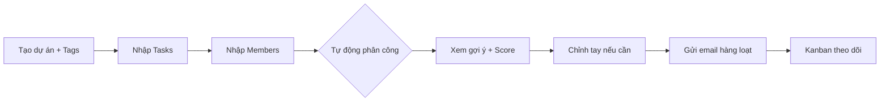

# Task Assignment System
## Tự động phân công việc nhóm theo kỹ năng + thời gian rảnh

**Môn CSC12106 — Tương tác Người-Máy | Nhóm 8 — 23HTTT01**
23127110 · 23127385 · 23127495 — 01/09/2026

> **BASE DECK** — dựng từ phần đã hoàn thành. Các slide [TODO] sẽ hoàn thiện khi đủ scenario/storyboard/evaluation.

---

## Agenda

1. Vấn đề & Cơ hội (Research n=15)
2. Personas (3 roles)
3. Giải pháp & Workflow
4. Thuật toán Mapping (0.7/0.3 Greedy)
5. Wireframe 6 màn + Prototype
6. Kết quả hiện tại & Roadmap
7. Q&A

---

## 1. Vấn đề: phân công thủ công

- **Hiện trạng:** 73% dùng chat (Messenger/Zalo), 40% Sheets — giao việc theo cảm tính/trí nhớ
- **Hệ quả khảo sát n=15:**
  - 40% bị giao việc sai kỹ năng · 40% mất cân bằng tải · 33% không rõ deadline
  - Hài lòng trung bình **5.6/10**
  - 33% Thường xuyên quá tải, 53% Thỉnh thoảng
- **Trích dẫn:**
  > *"Tối nào cũng phải nhắn từng đứa hỏi đến đâu rồi?"* — Minh Anh, trưởng nhóm

---

## 2. Người dùng mục tiêu (Personas) — ✅ Đã xong

| Persona | Vai trò | Pain chính | Cần gì |
|---------|---------|------------|--------|
| **Nguyễn Minh Anh** 21t CNTT | Trưởng nhóm | Giao theo cảm tính, phát hiện quá tải muộn | Thấy ai rảnh/quá tải, chia công bằng |
| **Trần Hoàng Dũng** 20t KT | Thành viên | Không rõ việc/deadline, sai chuyên môn | Checklist rõ, cảnh báo quá tải |
| **Lê Thị Minh Lan** 35t | Giảng viên | Chỉ thấy báo cáo cuối kỳ | Tiến độ thực tế + đóng góp |

Nguồn: `persona/personas.md` + `survey_answers.csv` (n=15). Ảnh: `persona/persona.png`

---

## 3. Nhu cầu được xác thực

- **Tính hữu ích (1–5):** gợi ý ai làm gì **4.1** · Gantt **3.9** · cảnh báo quá tải **4.2**
- **Sẵn sàng dùng:** 53% Chắc chắn + 40% Có thể = **93% cởi mở**
- **Rào cản:** học lâu 47%, cấu hình phức tạp 33% → **UI phải đơn giản, bắt đầu nhanh**
- **Mong muốn mở:** cảnh báo deadline qua chat, xem ai rảnh/quá tải, chỉnh tay trước khi chốt

=> Thiết kế ưu tiên: **1 Global Skill Pool · CTA to · chỉnh tay dễ · score minh bạch**

---

## 4. Giải pháp đề xuất

**Web tool cho nhóm nhỏ 4–5 người:**

1. Định nghĩa **Global Skill Tags** 1 lần (Frontend/Backend/UIUX...)
2. Nhập **Tasks** (tên + tag yêu cầu + giờ + ưu tiên + deadline)
3. Nhập **Members** (tên + email + tag + giờ rảnh/tuần)
4. Bấm **Tự động phân công** → bảng preview với score + badge
5. **Chỉnh tay** (dropdown) → **Gửi thông báo** (Resend, có dialog xác nhận)
6. Theo dõi **Kanban** To Do / Doing / Done

Stack: **React+Vite + Supabase + Resend + Vercel** (AGENTS.md §2)

---

## 5. Workflow chính

Nguồn: `wireframe/flows.md`

---

## 6. Thuật toán Mapping — Weighted Scoring

Với mỗi cặp `(task, member)`:

- `skill_score = matchCount / totalRequiredTags`
- `availability_score = 1` nếu `remaining ≥ task.hours`, ngược lại `remaining/task.hours`
- **`total = 0.7·skill + 0.3·availability`** → badge High ≥80 Mid 50–79 Low <50

**Greedy:** sắp xếp task theo priority (Cao 3→1) rồi hours ↓, chọn member điểm cao nhất còn đủ giờ, trừ `remainingHours`.

Code: `prototype/src/utils/assignmentAlgorithm.js`

---

## 7. Wireframe — 6 màn (✅ Đã xong)

- **Hybrid Jira + Trello + Asana + Linear** — palette `#0052CC / #F7F8F9 / #172B4D` (AGENTS.md §4)
- **Dashboard:** stats + Global Skill Pool + workload chart
- **Tasks/Members:** table có filter, import CSV, progress bar
- **Gợi ý:** slider w1/w2, score breakdown, dropdown manual override
- **Kanban:** 4 cột CẦN LÀM / ĐANG LÀM / REVIEW / HOÀN THÀNH — card có tag + score + avatar
- **Dialog:** preview email + checkbox xác nhận

Ảnh: `wireframe/screens/wireframe-export.png` · Spec: `screens/spec.md` · Quyết định: `DESIGN_DECISIONS.md`

---

## 8. Prototype tương tác (✅ Đã chạy)

- **Stack:** React + Vite + Tailwind + lucide-react
- **Data mẫu:** 5 tasks + 4 members (khớp personas)
- **Tính năng:** thêm/sửa/xóa task/member, import CSV mẫu, **chạy mapping với loading 5 bước**, preview chỉnh tay, gửi mail giả lập, Kanban, cảnh báo quá tải live
- **Chạy:** `cd prototype && npm i && npm run dev`
- **Test cases:** 7 cases TC-01→07 trong `prototype/plan.md`

---

## 9. Demo — Screenshots

> Chèn ảnh từ `wireframe/screens/wireframe-export.png` và `prototype` khi present
> Trong Marp: ``

- Trái: bảng preview với badge High/Mid/Low
- Phải: Kanban 4 cột + workload chart

*Base deck giữ placeholder — thay bằng ảnh thật trước khi xuất Canva.*

---

## 10. Tiến độ hiện tại

| Hạng mục | Trạng thái | Nguồn |
|----------|------------|-------|
| Persona + Survey n=15 | ✅ Xong | `persona/*` |
| Wireframe 6 màn + Spec | ✅ Xong | `wireframe/*` |
| Prototype + Thuật toán | ✅ Xong | `prototype/*` |
| Value Proposition | ⏳ TODO | `value_proposition/` rỗng |
| Scenario 1/2 | ⏳ TODO | `scenario_*/` rỗng |
| Storyboard | ⏳ TODO | `storyboard/` rỗng |
| Evaluation (5 users) | ⏳ TODO | Chưa làm |
| Supabase + Resend thật | ⏳ 50% | Mới frontend |

---

## 11. Roadmap Phase 2

- Hoàn thiện Value Prop / Scenario / Storyboard (để đủ rubric)
- Chạy **evaluation** heuristic + think-aloud với 5 end-users → cập nhật report §10
- Tích **Supabase** (Postgres + RLS + Edge Functions) + **Resend** thật
- Thêm Gantt timeline, **Hungarian Algorithm** nếu cần tối ưu toàn cục
- Deploy Vercel → link demo trong báo cáo + slide

---

## 12. Kết luận

- Vấn đề phân công cảm tính đã được **xác thực bằng dữ liệu** (n=15)
- Giải pháp **auto-mapping minh bạch + chỉnh tay + 1-nút gửi mail** đáp ứng đúng pains của 3 personas
- Wireframe & Prototype đã chứng minh tính khả thi — sẵn sàng tích backend

> **Tiếp theo:** hoàn thiện các phần TODO, sau đó rebuild `report.pdf + report.docx` và `slides.pdf` để import Canva touch-up.

---

## Q&A — Cảm ơn!

**TaskAssign AI — Nhóm 8**

- Repo: `HTTT01_HCI/`
- Báo cáo: `report/report.pdf + report.docx` (từ `report/src/main.md`)
- Slide: `slides/slides.pdf` (từ deck này → Canva)

*Câu hỏi cho giảng viên/hội đồng?*

